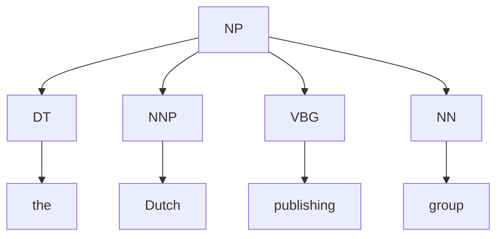
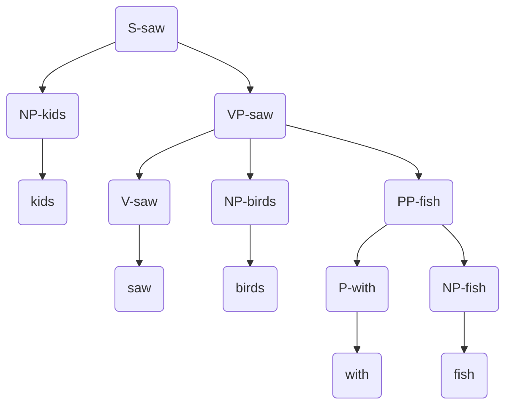
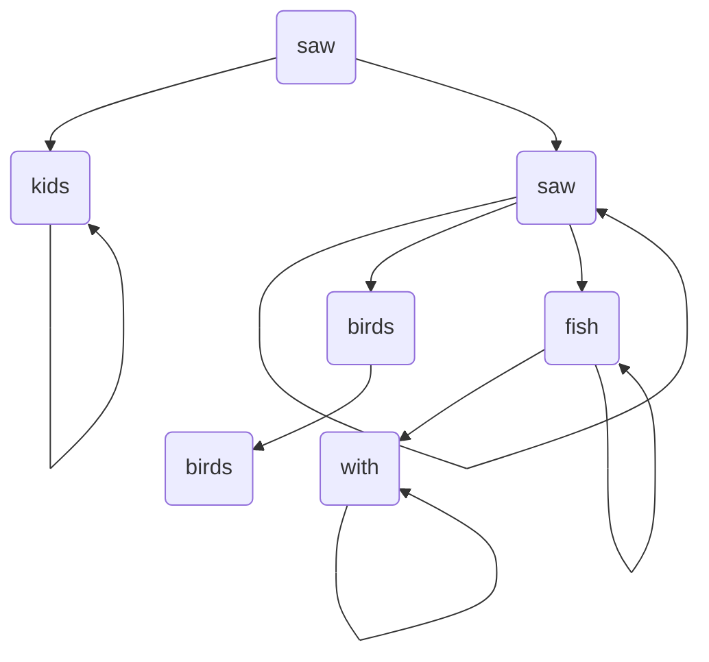
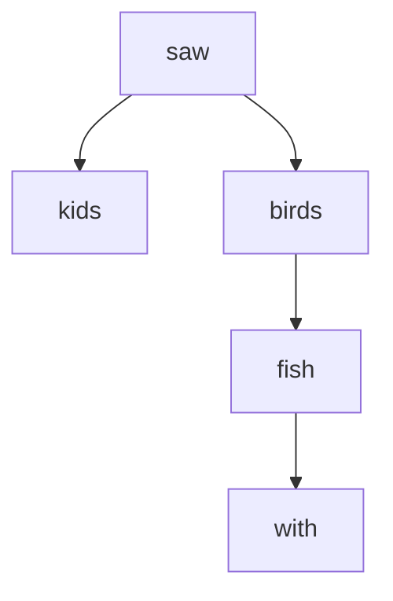

# Contents
- [[#Variability|Variability]]
- [[#Ambiguity|Ambiguity]]
- [[#Zipf's Law|Zipf's Law]]
- [[#Uncertainty in NLP|Uncertainty in NLP]]
	- [[#Uncertainty in NLP#Probabilistic models|Probabilistic models]]
- [[#Corpora|Corpora]]
	- [[#Corpora#Sentiment Analysis|Sentiment Analysis]]
	- [[#Corpora#Tokenisation|Tokenisation]]
- [[#Inter-annotator agreement|Inter-annotator agreement]]
- [[#Gold Standard Evaluation|Gold Standard Evaluation]]
	- [[#Gold Standard Evaluation#K-Fold Cross-validation|K-Fold Cross-validation]]
- [[#Advanced evaluation methods|Advanced evaluation methods]]
	- [[#Advanced evaluation methods#Accuracy|Accuracy]]
	- [[#Advanced evaluation methods#Recall|Recall]]
	- [[#Advanced evaluation methods#Precision|Precision]]
	- [[#Advanced evaluation methods#Confusion Matrices|Confusion Matrices]]
- [[#F-Score|F-Score]]
- [[#Significance Testing|Significance Testing]]
- [[#Prediction|Prediction]]
- [[#MLE|MLE]]
	- [[#MLE#Estimating bigram probabilities with MLE|Estimating bigram probabilities with MLE]]
	- [[#MLE#Problem with using MLE for sentences|Problem with using MLE for sentences]]
- [[#Trigram independence assumption|Trigram independence assumption]]
- [[#Types of Evaluation|Types of Evaluation]]
	- [[#Types of Evaluation#Extrinsic|Extrinsic]]
	- [[#Types of Evaluation#Intrinsic|Intrinsic]]
- [[#Entropy|Entropy]]
	- [[#Entropy#Examples of entropy|Examples of entropy]]
		- [[#Examples of entropy#One event|One event]]
		- [[#Examples of entropy#4 equally likely events|4 equally likely events]]
		- [[#Examples of entropy#3 equally likely events, and one more likely|3 equally likely events, and one more likely]]
	- [[#Entropy#Encoding entropy|Encoding entropy]]
- [[#Cross-entropy|Cross-entropy]]
- [[#Perplexity|Perplexity]]
- [[#Laplace Smoothing|Laplace Smoothing]]
- [[#Lidstone Smoothing|Lidstone Smoothing]]
- [[#Good Turing Smoothing|Good Turing Smoothing]]
	- [[#Good Turing Smoothing#Good Turing: 0-count|Good Turing: 0-count]]
	- [[#Good Turing Smoothing#Good Turing: 1 count|Good Turing: 1 count]]
- [[#Interpolation|Interpolation]]
- [[#Katz back-off|Katz back-off]]
- [[#Kneser-Ney Smoothing|Kneser-Ney Smoothing]]
- [[#How to handle similar words (an early tease of [[#Neural Embeddings]])|How to handle similar words (an early tease of [[#Neural Embeddings]])]]
- [[#Bayes' rule|Bayes' rule]]
- [[#The problem|The problem]]
- [[#Hard EM vs True EM|Hard EM vs True EM]]
- [[#Likelihood functions|Likelihood functions]]
- [[#Naive Bayes Assumption and modelling $P(d|c)$|Naive Bayes Assumption and modelling $P(d|c)$]]
- [[#Naive Bayes Classifier|Naive Bayes Classifier]]
- [[#Estimating priors and feature probabilities|Estimating priors and feature probabilities]]
	- [[#Estimating priors and feature probabilities#$\hat{P}(c)$|$\hat{P}(c)$]]
	- [[#Estimating priors and feature probabilities#$\hat{P}(f_{i}|c)$|$\hat{P}(f_{i}|c)$]]
- [[#Costs|Costs]]
- [[#Semi-supervised learning (with [[#EM]])|Semi-supervised learning (with [[#EM]])]]
- [[#$\sigma(z)$|$\sigma(z)$]]
- [[#Softmax|Softmax]]
- [[#Logistic Regression Learning|Logistic Regression Learning]]
	- [[#Logistic Regression Learning#Cross-entropy loss|Cross-entropy loss]]
	- [[#Logistic Regression Learning#Gradient Descent|Gradient Descent]]
		- [[#Gradient Descent#The Gradient Descent formula|The Gradient Descent formula]]
- [[#Methods of combining stems and affixes|Methods of combining stems and affixes]]
- [[#Parsing and generation|Parsing and generation]]
- [[#FSAs|FSAs]]
- [[#Finite State Transducers|Finite State Transducers]]
	- [[#Finite State Transducers#Porter Stemmer|Porter Stemmer]]
- [[#A quick aside on POS taggins|A quick aside on POS taggins]]
- [[#From [[#FSAs]] to [[#HMMs]]|From [[#FSAs]] to [[#HMMs]]]]
	- [[#From [[#FSAs]] to [[#HMMs]]#Formalising the tagging problem|Formalising the tagging problem]]
- [[#Markov Assumption|Markov Assumption]]
- [[#HMMs|HMMs]]
- [[#Viterbi|Viterbi]]
- [[#Constituency tests|Constituency tests]]
	- [[#Constituency tests#Coordination|Coordination]]
	- [[#Constituency tests#Clefting|Clefting]]
- [[#Context Free Grammars|Context Free Grammars]]
- [[#Constituency trees|Constituency trees]]
- [[#Parsers|Parsers]]
- [[#Chomsky Normal Form|Chomsky Normal Form]]
	- [[#Chomsky Normal Form#Converting to CNF|Converting to CNF]]
- [[#The Actual CYK Algorithm|The Actual CYK Algorithm]]
- [[#CYK for parsing|CYK for parsing]]
- [[#[[#CYK Algorithm|CYK]] for PCFGS|[[#CYK Algorithm|CYK]] for PCFGS]]
- [[#[[#MLE]] and [[#Smoothing]] for PCFG Parsing|[[#MLE]] and [[#Smoothing]] for PCFG Parsing]]
- [[#Unary Closure|Unary Closure]]
- [[#CYK Pruning|CYK Pruning]]
- [[#Intrinsic and Extrinsic|Intrinsic and Extrinsic]]
- [[#Bracket Scores|Bracket Scores]]
- [[#Vertical & Horizontal Markovisation|Vertical & Horizontal Markovisation]]
- [[#[[#EM]] for splitting|[[#EM]] for splitting]]
- [[#Anchored Rules|Anchored Rules]]
- [[#Edge Labels|Edge Labels]]
	- [[#Edge Labels#Projectivity|Projectivity]]
- [[#Transition-based dependency parsing|Transition-based dependency parsing]]
- [[#Graph-based dependency parsing|Graph-based dependency parsing]]
- [[#Conversion-based dependency parsing|Conversion-based dependency parsing]]
- [[#First-order logic for semantics|First-order logic for semantics]]
	- [[#First-order logic for semantics#Davidsonian Semantics|Davidsonian Semantics]]
- [[#Lambda-calculus and Beta reduction|Lambda-calculus and Beta reduction]]
- [[#Scope Ambiguities|Scope Ambiguities]]
- [[#Coherence|Coherence]]
	- [[#Coherence#Time|Time]]
	- [[#Coherence#Word meanings|Word meanings]]
	- [[#Coherence#Bridging|Bridging]]
	- [[#Coherence#Dishonesty|Dishonesty]]
	- [[#Coherence#Gestures|Gestures]]
- [[#SDRT and Logical Form|SDRT and Logical Form]]
	- [[#SDRT and Logical Form#Example, using John's safe|Example, using John's safe]]
- [[#Supervised learning for SDRT|Supervised learning for SDRT]]
- [[#Hyponyms and Hypernyms|Hyponyms and Hypernyms]]
- [[#Regular Polysemy|Regular Polysemy]]
- [[#Word Sense disambiguity|Word Sense disambiguity]]
	- [[#Word Sense disambiguity#Altering [[#Naive Bayes]] for WSD|Altering [[#Naive Bayes]] for WSD]]
- [[#WordNet|WordNet]]
	- [[#WordNet#Named Entity Recognition|Named Entity Recognition]]
- [[#Supersense tagging|Supersense tagging]]
- [[#Distributional hypothesis|Distributional hypothesis]]
	- [[#Distributional hypothesis#First and second order co-occurence|First and second order co-occurence]]
- [[#PMI|PMI]]
- [[#Vector space representation of context vectors|Vector space representation of context vectors]]
	- [[#Vector space representation of context vectors#Evaluation: word association|Evaluation: word association]]
- [[#One-hot Vectors|One-hot Vectors]]
- [[#Latent Semantic Analysis|Latent Semantic Analysis]]
- [[#Word2Vec|Word2Vec]]
	- [[#Word2Vec#Skip-gram model|Skip-gram model]]
	- [[#Word2Vec#Negative-Log-Likelihood Cost Function|Negative-Log-Likelihood Cost Function]]
		- [[#Negative-Log-Likelihood Cost Function#Computing $P(w_{t+j}|w_{t},\theta)$|Computing $P(w_{t+j}|w_{t},\theta)$]]
	- [[#Word2Vec#Optimisation with [[#Gradient Descent]]|Optimisation with [[#Gradient Descent]]]]
	- [[#Word2Vec#Negative Sampling|Negative Sampling]]
- [[#Continuous Bag of Words model|Continuous Bag of Words model]]
- [[#Classification techniques|Classification techniques]]
- [[#Representing documents as vectors|Representing documents as vectors]]
- [[#Bag of Embeddings|Bag of Embeddings]]
- [[#Pooling|Pooling]]
- [[#Anatomy of an RNN cell|Anatomy of an RNN cell]]
- [[#Vanilla RNN model|Vanilla RNN model]]
- [[#Improving the [[#Vanilla RNN model]]|Improving the [[#Vanilla RNN model]]]]
	- [[#Improving the [[#Vanilla RNN model]]#Multi-layer RNN|Multi-layer RNN]]
	- [[#Improving the [[#Vanilla RNN model]]#Bidirectional RNN|Bidirectional RNN]]
- [[#Residual connections|Residual connections]]
- [[#Anatomy of a neural language model|Anatomy of a neural language model]]
- [[#Training a neural language model (loss)|Training a neural language model (loss)]]
- [[#Comparing [[#N-gram LMs]] and [[#Recurrent Neural Networks|RNN LMs]]|Comparing [[#N-gram LMs]] and [[#Recurrent Neural Networks|RNN LMs]]]]
- [[#Greedy Decoding|Greedy Decoding]]
- [[#Encoder-decoder framework|Encoder-decoder framework]]
	- [[#Encoder-decoder framework#Conditional Language Modelling|Conditional Language Modelling]]
	- [[#Encoder-decoder framework#[[#Recurrent Neural Networks|RNNs]] for encoder-decoder|[[#Recurrent Neural Networks|RNNs]] for encoder-decoder]]
- [[#Beam search|Beam search]]
- [[#Evaluation: BLEU metric|Evaluation: BLEU metric]]
- [[#Subword tokenisation|Subword tokenisation]]
- [[#Neural Attention Model|Neural Attention Model]]
- [[#Attention scores|Attention scores]]
	- [[#Attention scores#Dot product|Dot product]]
	- [[#Attention scores#Bilinear|Bilinear]]
	- [[#Attention scores#Multilayer perceptron|Multilayer perceptron]]
- [[#Bahdanau attention|Bahdanau attention]]
- [[#Luong Attention|Luong Attention]]
- [[#Attention and alignment|Attention and alignment]]
- [[#Self-attention|Self-attention]]
- [[#Query-key-value attention|Query-key-value attention]]
	- [[#Query-key-value attention#Attention Formula|Attention Formula]]
- [[#Masked self-attention|Masked self-attention]]
- [[#Multi-head attention|Multi-head attention]]
- [[#Transformer Architecture|Transformer Architecture]]
	- [[#Transformer Architecture#Feed-forward blocks|Feed-forward blocks]]
	- [[#Transformer Architecture#Layer normalisation|Layer normalisation]]
	- [[#Transformer Architecture#Positional encoding|Positional encoding]]
- [[#Using pre-trained embeddings and fine-tuning|Using pre-trained embeddings and fine-tuning]]
- [[#Limitations of transfer with word embeddings|Limitations of transfer with word embeddings]]
- [[#Word-in-context embeddings|Word-in-context embeddings]]
- [[#ELMo|ELMo]]
- [[#BERT|BERT]]
	- [[#BERT#Masked Language Modelling|Masked Language Modelling]]

# Ambiguity and Corpora
The main difficulties of NLP are [[#Variability]] and [[#Ambiguity]], two different problems that arise between the relations between the *meaning* of a sentence and the *language* used in a sentence. Ideally, we'd want one-to-one, but this is rarely the case. Instead, we usually get a one-to-many or many-to-one.
## Variability
Variability when one sentence meaning can have multiple language interpretations. For example, the sentence:
 
 > He drew the house
 
could refer to:
- He made a sketch of the house
- *He showed me* his drawing of the house
- He portrayed the house in his paintings
- He drafted the house *in his sketchbook*
## Ambiguity
Ambiguity (arguably the more pressing challenge in NLP) is when the language used in a sentence can have *multiple different **valid** meanings*. There are many different types of ambiguity:
- Homophones: *blew* and *blue*
- Word senses: *bank* (finance or river?)
- Part of speech: *chair* (noun or verb?)
- Syntactic structure: *I saw a girl with a telescope*
- Quantifier scope: *Every child loves some movie*
- Multiple: *I saw her duck*
	- (word senses and syntactic)
- Reference: *John dropped the goblet onto the glass table and it broke.*
- Discourse: *The meeting is cancelled. Nicholas isn't coming to the office today*
- Syntactic Ambiguity: *Put the block in the box on the table in the kitchen*
	- If we have an ambiguous sentence like this with $n$ prepositional phrases, the amount of interpretations is $Cat_{n}$ (*Catalan Numbers*), where $$Cat_{n} = \begin{pmatrix}2n\\n\end{pmatrix} - \begin{pmatrix}2n\\n-1\end{pmatrix} \sim \frac{4^{n}}{n^{3/2}\sqrt{\pi}}$$ 
## Zipf's Law
If we count the amount of words in some [[#Corpora]] to get their *frequency* $f$, and then *rank them in order of most frequent* ($r$), we can plot these values against each other. The result looks something like this:
![[Zipf, unlogged.png]]
This is quite unreadable, so if we use *logarithmic* axes we can see what's going on:
![[Zipf, logged.png]]
This phenomenon is known as ***Zipf's Law***, and is formally defined (in the slides) as $$f \times r \approx k$$, where $k$ is some constant. Most other online sources seem to fix $k=1$ and explicitly write that the *frequency of a word is **inversely proportional** to it's rank in our frequency table*. $$f = \frac{1}{r}$$
The implications of this mean that regardless of how big our corpus is, we will *always* find words we've barely seen before. This proves a problem when we want to find methods of estimating probabilities for *all* words.
## Uncertainty in NLP
Most problems we come across are manifestations of uncertainty
- [[#Ambiguity]] - uncertainty in interpretation
- [[#Variability]] - uncertainty in a specific realisation
- **Robustness** - uncertainty with potential inputs
	- We may have many different types of input (e.g. formal/informal)
- **Context Dependence** - uncertainty with previous information

All of these uncertainties basically force our hand into using *[[#Probabilistic models]]/Machine Learning* 
### Probabilistic models
A probabilistic model has a **inputs** (*set of words+context / utterances*) and **outputs** (*set of Part-of-speech (POS) tags / syntactic analyses*)

| input     | output     |     | input                                                          | output  |
| --------- | ---------- | --- | -------------------------------------------------------------- | ------- |
| $input_1$ | $output_1$ |     | $\textlangle \text{the, } \underline{\text{list}} \textrangle$ |         |
| $input_2$ | $output_2$ |     | $\textlangle \text{We, } \underline{\text{list}} \textrangle$  |         |
| $\dots$   | $\dots$    |     | $\dots$                                                        | $\dots$ |

## Corpora
A *corpus* (plural *corpora*) is a "body of utterances, as words or sentences". Corpora should be naturally occurring to serve as realistic samples of a language. Corpora are also *linguistically [[#Annotation methods|annotated]]*; humans have read this text and marked the structures describing syntax/meaning. 
### Sentiment Analysis
A simple linguistic analysis where we try to tell the sentiment of a given piece of text (good example: a movie review) - is it *positive* or *negative*? This example would be easy to test for accuracy, as we can use the numerical score provided.

A simple sentiment analyser would use a positive and negative "list" (a *sentiment lexicon*) to count the number of positive and negative words. This is a naive approach; words may be ambiguous, may be used in contexts not useful to the overall sentiment
### Tokenisation
We want to split a corpus into separate word/punctuation **tokens** (occurrences), not already separated by spaces. These *tokens* are the individual building blocks for any Language Model to act upon.
# Annotation methods
Annotating is a potentially long and costly job. We may need to consider
- source data (size? Licensing?)
- annotation scheme (complexity? Guidelines)
- annotators (expertise? training?)
- Quality control procedures

We devise a set of *annotation guidelines* to help annotators produce **consistent** data, and to help users interpret the annotations correctly. The *Penn Treebank* has a >300 page long guideline document!
## Inter-annotator agreement
Human annotators are not perfect. Conversely, due to [[#Ambiguity]], there may be multiple possible (equally correct) annotations. *IAA* is the process of getting multiple annotators to "agree" on independently annotated samples. The agreement rate can be thought of as an *upper bound* on the accuracy of a system evaluated on that dataset.

Still, some annotation decisions are far more frequent than others. The **Kappa** coefficient $K$ measures agreement between two people making category judgements, correcting for expected chance agreement.
For example, in a scenario where an item is annotated and 4 coding options are equally likely, then the two annotators will agree 25% of the time. Therefore an agreement of 25% will be assigned $K=0$ and will scale accordingly (e.g. 50% would be $K=0.333$ since 50 is a third of the way from 25 to 100).
%% ## Chance Correction - this never comes up in the slides or J&M? Idk if this is Kappa but under a different name%%
## Gold Standard Evaluation
The gold standard is '*the truth*'; what the original writer *actually* meant when producing the individual text. Gold standards are used for both training and evaluation, but **testing must be done on unseen data**.

When designing a system, we often *tune* it by changing configuration options. If we run several experiments on our "test set", we risk **overfitting** it; this set no longer holds as a reliable *proxy* for new data.
### K-Fold Cross-validation
We often split our dataset into test/train/dev pieces. We *only training the model on a **training** set*. We then can *test the model* on the ***test set***. Devsets are used for evaluating different models, debugging, and optimising.

If our model is *too small* to reasonably create sufficiently sized sets, we can use *k-fold cross validation*. This process breaks the data into $k$ pieces and treats one as a held-out set - the remaining are used to train a model. This held out set is used to test these different *folds*. We can then combine all learned information through the use of cross-validation.
# Evaluation methods
The simplest method of measuring a model's *performance* is the **proportion model**: $$\frac{\text{right}}{\text{test set}}\times 100$$
This is okay for some tasks, but not all
## Advanced evaluation methods
We can use the following methods in a system that can produce true/false positives/negatives (a total of 4 possible answers). We use $\text{tp, tn, fp}$ and $\text{fn}$ to represent these  
### Accuracy
The percentage of all observations that were labelled correctly. $$\frac{\text{tp+tn}}{\text{tp+fp+tn+fn}}$$
### Recall
The percentage of items actually present in the input that were correctly identified by the system. $$\frac{\text{tp}}{\text{tp+fn}}$$
### Precision
The percentage of items the system detected *that were actually positive*. $$\frac{\text{tp}}{\text{tp+fp}}$$
### Confusion Matrices
A way of representing all of these different metrics is through use of a *confusion matrix*. ![[A Confusion Matrix.png]]
## F-Score
A combination of [[#Precision]] ($P$) and [[#Recall]] ($R$), the **F-measure** is formally defined as $$F_{\beta} = \frac{(\beta^{2}+1)PR}{\beta^{2}P+R}$$
Values of $\beta > 1$ favour *recall*, and values of $\beta < 1$ favour precision. When $\beta = 1$ they are balanced; this $F_{1}$ metric is the most commonly used and can be more clearly defined as $$F_{1} = \frac{2PR}{P+R}$$
## Significance Testing
If we have a model with 95% accuracy, how can we tell if this is good or bad?

We can use an *upper bound* ([[#Inter-annotator agreement]] rate as discussed earlier) and a lower bound (performance of a "simpler" model) to measure how *significantly* better/worse our model is.

There are two types of significance tests:
-  **Parametric**
	- Used when the underlying distribution is *normal*/*Gaussian*.
- **Non-parametric**
	- Used otherwise
# N-gram LMs
 > *1.5k words into notes and we're finally talking about an actual language model!!*  
 
%%very proud that this metric is actually correct%%

Due to [[#Zipf's Law|the Zipfian curve]] it's very hard to predict possible sentence structures just based on words alone; we need to determine (ideally, what we actually do is *approximate*) the **plausibility** of a sentence. For example, 
$$\begin{eqnarray}
P(\text{the cat slept peacefully}) &>& P(\text{slept the peacefully cat}) \\
P(\text{she studies morphosyntax}) &>& P(\text{she studies more faux syntax})
\end{eqnarray}$$
*N-gram* models are one such language model that approximates this plausibility for us. They can be used for:
- **Spelling correction**
	- Generate possible "correct" spellings for a certain text and pick the best guess
- **Automatic speech recognition**
	- Generate multiple possible text interpretations of speech and pick the best guess
- **Machine translation**
	- Generate multiple possible translations (in the target language) and pick the be- *you get the idea*

N-grams are most well-known for their use in [[#Prediction]]
## Prediction
We want to compute $P(w|h)$, the probability of a word $w$ given a history $h$. For example, if our history is "*its water is so transparent that*" and we want to know the probability of our next word being *the*, we would be finding $$P(\text{the|its water is so transparent that})$$
A method of calculating this probability would be to use *relative frequency counts* $C$: $$
\begin{eqnarray}
P(\text{the|its water is so transparent that}) =\\
\frac{C(\text{its water is so transparent that the})}{C(\text{its water is so transparent that})}
\end{eqnarray}$$
This is still not sufficient; language is creative and we won't always be able to count entire sentences.

We'll need more clever ways to estimate $P(w|h)$. If we instead change contexts to representing the probability of a sequence of $n$ words $w_{1}, \dots, w_{2}$. If we want to predict the probability of $P(\text{the})$, we can write it as $P(X_{i}=\text{"the"})$. So the probability of a sequence of words can be written both as $$P(X_{1}= w_{1}, X_{2}= w_{2}, \dots, X_{n}= w_{n})$$ and $P(w_{1}, w_{2}, \dots, w_{n})$ or $P(w_{1:n})$.

We can now use the *chain rule* to decompose this probability: $$\begin{eqnarray}
P(w_{1}, \dots, w_{n}) &=& P(w_{1})P(w_{2}|w_{1})P(w_{3}|w_{1:2})\dots P(w_{n}|w_{1:n-1}) \\&=& \displaystyle\prod_{i=1}^n{P(w_{i}|w_{1}, w_{2}, \dots, w_{i-1})}
\end{eqnarray}$$
A **bigram** model ($n=2$), for example, approximates the probability of a word by *only using* the conditional probability of the preceding word; we would approximate the above transparent water example with $$P(\text{the|that})$$
This assumption that we can reasonably estimate the probability of a word based on only the prior is called a **Markov** assumption. N-grams make a Markov assumption that we only need to look $n-1$ words into the past. For n-gram size $N$, $$P(w_{n}|w_{1:n-1})\approx P(w_{n}|w_{n-N+1:n-1})$$
However, given the *bigram assumption for the probability* of an individual word, we can compute the probability of a **complete word sequence** by substituting this into our original equation to get $$P(w_{1:n})\approx \displaystyle\prod^{n}_{k=1}P(w_{k}|w_{k-1})$$
How do we get the individual *bigram probabilities* $P(w_{k}|w_{k-1}$)? We can [[#Estimating bigram probabilities with MLE|estimate probabilities with MLE]].
## MLE
We can estimate discrete probabilities with $$P_{RF}=\frac{C(x)}{N}$$ where $C(x)$ is the *count* of $x$ in a large dataset, and $N$ is the total number of items in the dataset.

This is known as **maximum-likelihood estimation**, or more commonly **MLE**.
 
 > *Aside*: this is also known as Relative Frequency estimation, hence why it says $P_{RF}$.
### Estimating bigram probabilities with MLE
To compute a particular bigram probability of a word $w_{n}$ given previous word $w_{n-1}$, we compute the count of the bigram $C(w_{n-1}w_{n})$ (that is to say, how many times "*previousword word*" appears), and then normalise this by dividing by how many bigrams also share the same first word $w_{n-1}$: $$P(w_{n}|w_{n-1}) = \frac{C(w_{n-1}w_{n})}{\sum\limits_{w}C(w_{n-1}w)}$$
This can be simplified - the amount of times "$w_{n-1}$ $w_{n}$" appears is the same as the *unigram* count for the amount of times "$w_{n-1}$" appears, so we can instead just write $$P(w_{n}|w_{n-1}) = \frac{C(w_{n-1}w_{n})}{C(w_{n-1})}$$
### Problem with using MLE for sentences
If we have a sentence $\vec{w}$ we could say $$P_{MLE}(\vec{w})=\frac{C(\vec{w})}{N}$$
The problem with this is that if we ever get a sentence that *has not appeared* in our corpus, $P=0$; MLE thinks anything *that **hasn't** occurred will **never** occur*.
## Trigram independence assumption
Under a trigram independence assumption, all 
- $P(\text{mast|I spent three years before the})$
- $P(\text{mast|I went home before the})$
- $P(\text{mast|I saw the sail before the})$
- $P(\text{mast|I revised all week before the})$

are estimated as $P(\text{mast|before the})$. The general rule is $$P_{MLE}(w_{i}|w_{i-2}, w_{i-1})=\frac{C(w_{i-2}, w_{i-1}, w_{i})}{C(w_{i-2}, w_{i-1})}$$
(The amount of times the three words have appeared over the amount of times the previous two words appeared).
# Evaluation of LMs
## Types of Evaluation
There are different metrics for which we can evaluate how "good" a LM is.
### Extrinsic
Extrinsic evaluations are "plugged into" a functional system, and then the system's performance is measured. This is most reliable, but an evaluation method for the system is also needed and the whole process is time consuming.
### Intrinsic
Intrinsic evaluations are inherent to the current task, but choosing the correct measure is difficult; ideally, this correlates with extrinsic measures.
## Entropy
Entropy is the *degree of uncertainty* a system has.

The definition of the **entropy** of a random variable $X$ is $$H(X) = \sum_x\limits-P(x)\log_{2}{P{x}}$$
It's basically giving the average $\log$, weighted with the probability $P(X)$. Higher values of entropy are present in *more uncertain* systems.
### Examples of entropy
#### One event
$$P(a) = 1$$
$$\begin{eqnarray}
H(X) &=& -1 \log_{2}1 \\
&=& 0
\end{eqnarray}$$
#### 4 equally likely events
$$\begin{eqnarray}
P(a) &=& 0.25 \\
P(b) &=& 0.25 \\
P(c) &=& 0.25 \\
P(d) &=& 0.25
\end{eqnarray}$$
$$
\begin{eqnarray}
H(X) &=& -0.25\log_{2}0.25 -0.25\log_{2}0.25 \\ &&-0.25\log_{2}0.25 -0.25\log_{2}0.25 \\
&=& -\log_{2}0.5 \\
&=& 2
\end{eqnarray}
$$
#### 3 equally likely events, and one more likely
$$
\begin{eqnarray}
P(a) &=& 0.7 \\
P(b) &=& 0.1 \\
P(c) &=& 0.1 \\
P(d) &=& 0.1
\end{eqnarray}
$$
$$
\begin{eqnarray}
H(X) &=& -0.7\log_{2}0.7-0.1\log_{2}0.1-0.1\log_{2}0.1-0.1\log_{2}0.1 \\
&=& -0.7\log_{2}0.7 - 0.3\log_{2}0.1 \\
&=& -(0.7)(-0.5146) - (0.3)(-3.3219) \\
&=& 0.36020 + 0.99658 \\
&=& 1.35678
\end{eqnarray}
$$
### Encoding entropy
- For a uniform distribution with $2^{n}$ outcomes
- When encoding a sequence of events $X$, we encode each event by a sequence of bits (using as few as possible)
	- The average number of bits needed to encode $X \geq$ entropy of $X$
- The measured entropy of English is about 1.3. That is to say, on average, a human would need 1.3 yes/no questions (about the context) to predict the next word in a sentence.
## Cross-entropy
For most corpora we cannot exactly calculate [[#Entropy]] as we do not know the *exact* word sequence probability distribution. We can, however, measure how close *an estimated probability distribution* $\hat{P}$ is to the true distribution $P$ via ***cross-entropy***: $$H(P, \hat{P}) = \sum\limits_{x}-P(x)\log_{2}\hat{P}(x)$$
But the problem was that we didn't know $P(x)$!
We can approximate this by using *word sequences* $w_{1}, \dots, w_{n}$ (with large $n$): $$H_{M}(w_{1}, \dots, w_{n})= -\frac{1}{n}\log_{2}P_{M}(w_{1}, \dots, w_{n})$$
Lower values of cross-entropy (like entropy) mean the model is *less uncertain (**better**)* at predicting the next word. Cross-entropy is also measured in bits; if we need to guess $x$ words with a cross entropy of $y$, we will need $x \times y$ yes/no questions.
## Perplexity
Perplexity is $2^{\text{cross-entropy}}$, and is the common metric for measuring uncertainty in models.
# Smoothing
Smoothing aims to solve the issue of [[#MLE]] estimating probabilities that *maximise* the training data; making everything else (unseen) *minimal*.
## Laplace Smoothing
*Add-one* smoothing, sometimes Laplace smoothing, basically pretends every possible word was seen one more time than it actually was. We can't simply just add 1 though - the probabilities won't all sum up to 1, so we need to normalise.

We want:
$$
\begin{aligned}
\sum_{w_i \in V} \frac{C(w_{i-2}, w_{i-1}, w_i) + 1}{C(w_{i-2}, w_{i-1}) + x} &= 1
\end{aligned}
$$
Solve for $x$:
$$
\begin{aligned}
\sum_{w_i \in V} \left(\frac{C(w_{i-2}, w_{i-1}, w_i) + 1}{C(w_{i-2}, w_{i-1}) + x}\right) &= \frac{C(w_{i-2}, w_{i-1}) + x}{C(w_{i-2}, w_{i-1}) + x} \\
\sum_{w_i \in V} C(w_{i-2}, w_{i-1}, w_i) + \sum_{w_i \in V} 1 &= C(w_{i-2}, w_{i-1}) + x \\
C(w_{i-2}, w_{i-1}) + v &= C(w_{i-2}, w_{i-1}) + x \\
v &= x
\end{aligned}
$$

where $v$ = vocabulary size.

Unfortunately, this normalisation flips our [[#Zipf's Law|Zipfian curve]] and now the super low probabilities happen to the common words such as "*it*", "*the*", and "*and*".
## Lidstone Smoothing
Add-$\alpha$ smoothing, sometimes Lidstone smoothing adds $\alpha$ instead, and this formula comes normalised $$P_{+\alpha}(w_{i}|w_{i-1})=\frac{C(w_{i-1}, w_{i}) + \alpha}{C(w_{i-1}+\alpha{v})}$$
This also assumed we know the vocab size in advance, but if we don't we can add a single "unknown" item and use it for all unknown words found during testing. The question on how to choose $\alpha$ is still a bit uncertain; we can use [[#K-Fold Cross-validation|splits]] and test multiple $\alpha$ values, choosing the one that minimises [[#Cross-entropy]] on the devset.
## Good Turing Smoothing
Our previous methods changed the denominator which had unintended effects even on the frequent events. Good Turing changes the numerator.

If [[#MLE]] is $P_{MLE}=\frac{c}{n}$, Good Turing uses *adjusted counts* $c^{*}$ instead: $P_{GT}=\frac{c^{*}}{n}$


Each probability gets pushed down to the count class.

| $c$ | $N_c$ | $P_{c}$       | $P_c(\text{total})$ | $c^*$             | $P^*_c$                      | $P^*_c(\text{total})$ |
| --- | ----- | ------------- | ------------------- | ----------------- | ---------------------------- | --------------------- |
| 0   | $N_0$ | 0             | 0                   | 0                 | $\frac{\frac{N_1}{N_0}}{N}$  | $\frac{N_1}{N}$       |
| 1   | $N_1$ | $\frac{1}{N}$ | $\frac{N_1}{N}$     | $2\frac{N_1}{N}$  | $\frac{2\frac{N_2}{N_1}}{N}$ | $\frac{2N_2}{N}$      |
| 2   | $N_2$ | $\frac{2}{N}$ | $\frac{2N_2}{N}$    | $3\frac{2N_2}{N}$ | $\frac{3\frac{N_3}{N_2}}{N}$ | $\frac{3N_3}{N}$      |
- $c$: count
- $N_c$: number of different items with count $c$
- $P_c$: MLE estimate of prob. of that item
- $P_c(\text{total})$: MLE total probability mass for all items with that count.
- $c^*$: Good-Turing smoothed version of the count
- $P^*_c$ and $P^*_c(\text{total})$: Good-Turing versions of $P_c$ and $P_c(\text{total})$

The basic idea is to arrange the discounts so the amount we *add* to total probability is matched by *all the discounting* in the other rows. 

Good-Turing depends on (real) adjacent count
$$
\begin{aligned}
c^{*} &= (c+1)\frac{N_{c+1}}{N_{c}} \\
P^{*}_{c} &= \frac{c^{*}}{N} \\
&= \frac{(c+1)\frac{N_{c+1}}{N_c}}{N}
\end{aligned}
$$

Since counts tend to go down as $c$ goes up, the multiplier is $\lt 1$.
The sum of all discounts is $\frac{N_{1}}{N_{0}}$; we need this to be true given that this is the *Good-Turing* count for row 0 (no count $c$).
### Good Turing: 0-count
$$P(\text{unseen}) = \frac{N_{1}}{n}$$
This uses MLE, we divide this probability equally amongst all unseen events $$P_{GT}=\frac{1}{N_{0}}\frac{N_{1}}{n} \rightarrow c^{*}=\frac{N_{1}}{N_{0}}$$
### Good Turing: 1 count
$$P(\text{once before})=\frac{2N_{2}}{n}$$
We estimate the probability that the next observation has count of 2 ([[#Laplace Smoothing|add-one]]). We then divide that probability equally amongst all 1-count events $$P_{GT}=\frac{1}{N_{1}}\frac{2N_{2}}{n}\rightarrow c^{*}=\frac{2N_{2}}{N_{1}}$$
## Interpolation
Interpolation solves the problems still remaining with [[#Good Turing Smoothing]]:
- It assumes we know vocabulary size (no unseen words)
- Doesn't allow "holes" in the counts (if $N_{i}>0, N_{i-1}>0$)
- Applies discounts to high-frequency items

Imagine in a training corpus we saw "*Scottish beer*", but we didn't see "*Scottish beer drinkers*" or "*Scottish beer eaters*". Despite the fact the term "*beer drinkers*" does appear (and "*beer eaters*" does **not**), a trigram model smoothed with [[#Lidstone Smoothing|add-alpha]] or [[#Good Turing Smoothing]] would rate the options equally likely.

The solution is to shorten our window to understand the "*beer drinkers*" information. Interpolation is one method of achieving this (the other being [[#Katz back-off|back-off]]).

Imagine we are trying to compute a trigram probability $P(w_{n}|w_{n-2}w_{n-1})$ but have no examples of this particular trigram. We can estimate it with the bigram probability $P(w_{n}|w_{n-1})$, which we could also estimate (if needed) with the unigram $P(w_{n})$. That being said, we need to combine these different estimates - solely using unigrams won't be useful.
We also want to weight these probabilities by a $\lambda$ value such that the final interpolated probability is between 0 and 1. Generally, we can estimate the probability $\hat{P}$ with $$\begin{aligned}\hat{P}(w_{n}|w_{n-2}w_{n-1}) &=& \lambda_{1}P(w_{n}) \\ &&+\lambda_{2}P(w_{n}|w_{n-1})\\ &&+\lambda_{3}P(w_{n}|w_{n-2}w_{n-1}) \end{aligned}$$
The values of $\lambda$ are *hyperparameters*, and are acquired through training. Typically, we [[#K-Fold Cross-validation|hold out]] a set corpus, and then choose the $\lambda$ values that **maximise** that corpus, possibly through techniques such as [[#Expectation Maximisation|EM]].
## Katz back-off
Back-off is the process of "backing off" (reverting to, switching) to a $n-1$-gram if we have zero count for a given n-gram. In order for a back-off model to give a correct probability distribution we need to *discount* the higher order n-grams to save the "probability mass" for lower order ones. We do this discounting after [[#Good Turing Smoothing]]. 
![[Katz Back-off visual representation.png]]
Formally, the probability for a back-off n-gram $P_{BO}$ is $$P_{BO}(w_{n}|w_{n-N+1:n-1})=\begin{cases}P^{*}(w_{n}|w_{n-N+1:n-1} & \text{if }C(w_{n-N+2:n-1})>0\\\alpha(w_{n-N+1:n-1})P_{BO}(w_{n}|w_{n-N+2:n-1}) & \text{otherwise.}\end{cases}$$
## Kneser-Ney Smoothing
Kneser-Ney Smoothing solves the issue caused by the **diversity of histories**.

In the *Europarl* corpus, the word "*York*" occurs 477 times - fairly frequent, so unigrams would give it a respectable probability. 473 of those times are preceded by "*New*"; in unseen bigram contexts, "*York*" should have a low probability - but [[#Interpolation]]/[[#Katz back-off|back-off]] predict this too high due to unigram models.

This can be solved by accounting for the diversity of context. If we have distinct histories for a word $N_{1+}(\bullet w_{i}) = |\{w_{i-1}:c(w_{i-1}, w_{i})\}|$, then using KN smoothing $$P_{KN}(w_{i})=\frac{N_{1+}(\bullet w_{i})}{\sum_{w}N_{1+}(\bullet w_{i})}$$
Eagle eyed students will notice this is literally the same things as [[#MLE]], just with history counts instead.
## How to handle similar words (an early tease of [[#Neural Embeddings]])
The above models do not contain any meaning of word *similarity*. If we had $$w_{1}= \text{salmon}; w_{2}=\text{swordfish}; C(w_{1}) >> C(w_{2})$$ then $P(\text{salmon|caught two})$ **would not tell us anything about** $P(\text{swordfish|caught two})$.

Traditional methods would be to define classes $c$ of words, so we'd be predicting $$P_{CL}=(w_{i}|w_{i-1})=P(c_{i}|c_{i-1})P(w_{i}|c_{i})$$
Recent versions (covered [[#Neural Embeddings|later]]) project words into a continuous psace such that words appearing in similar contexts have similar representations (in this space).
# Noisy Channel Model
A common problem is NLP is handling spelling errors. We don't want our models to process words that are not real, both in training and generation. We imagine this often with a "*noisy channel*" model, as if the original word has flown through the noisy channel and now spits out the misspelled artefact.

This is a *Bayesian* interface. We observe $x$ (a misspelled word) and our aim is to find the word $w$ that generated this misspelling. Out of all possible words in our vocabulary $V$, we want to find $w$ such that $P(w|x)$ is highest. Formally, our best estimate $\hat{w}$ is $$\hat{w} = \arg\limits_{w_\in{V}}\max{P(w|x)}$$
## Bayes' rule
The conditional probability $P(a|b)$ can be famously represented as $$P(a|b)=\frac{P(b|a)P(a)}{P(b)}$$
so if we substitute our previous equation in, we can estimate $$\hat{w}=\arg\limits_{w_\in{V}}\max\frac{P(x|w)P(w)}{P(x)}$$
and since $P(x)$ is static (it's talking about the same error word each time), we can just choose the word that maximises $$\hat{w}=\arg\limits_{w_\in{V}}\max{P(x|w)P(w)}$$
The *likelihood* of the noisy channel producing a particular observation $x$ is $P(x|w)$, and the *prior probability* of a hidden word is $P(w)$ 
# Edit Distance
We can approach the [[#Noisy Channel Model|spelling correction]] problem from earlier if we assume all corrections can be solved by a series of single character operations (**insertion, deletion**, and **substitution**). Then for each misspelling $x$:
- Generate a list of all words $y_{i}$ that differ by 1 character from $x_{i}$
- Compute $P(\overrightarrow{x}|\overrightarrow{y})P(\overrightarrow{y})$ for each $\overrightarrow{y}$, return one with the highest value

Imagine we had the mispelling (of "*not*"), "*no*". Our noise model would be $P(\text{no}|\text{not}) = P(n|n)P(o|o)P(-|t)$. Generally, for each *observed sequence* $\overrightarrow{x}$ made up of characters (including spaces) $x_{1}, \dots, x_{n}$, we have $$P(\overrightarrow{x}|\overrightarrow{y})=\prod^{n}_{i=1}P(x_{i}|y_{i})$$
We can build a confusion matrix from this: 

| $y/x$ | A   | B   | C   | D   | E   | F   | G   | H   | ... |
|-----|-----|-----|-----|-----|-----|-----|-----|-----|-----|
| A   | 168 | 1   | 0   | 2   | 5   | 1   | 1   | 0   | ... |
| B   | 0   | 136 | 1   | 0   | 3   | 2   | 5   | 0   | 3   |
| C   | 1   | 1   | 111 | 1   | 5   | 11  | ***36***  | 0   | ... |
| D   | 1   | 17  | 4   | 157 | 6   | 11  | 5   | 0   | ... |
| E   | 2   | 10  | 0   | 1   | 98  | 27  | 1   | 5   | ... |
| F   | 1   | 0   | 1   | 9   | 73  | 6   | 0   | 6   | ... |
| G   | 1   | 3   | 32  | 1   | 3   | 3   | 127 | 3   | ... |
| H   | 2   | 0   | 0   | 3   | 0   | 4   | 0   | 4   | ... |
| ... | ... | ... | ... | ... | ... | ... | ... | ... | ... |

Highlighted, we see that we saw *G* when intention was *C* ***36 times***. A matrix like this can be obtained from manual analysis on a corpus, 

The *edit distance* problem now boils "what word produces the fewest character changes" or the **minimum *edit distance* (MED)**. We commonly choose the cost of the 3 operations to be the same (1), but we can have them be whatever they want, even based on characters. We could define $$\text{cost}(\text{sub}{(c, c')}) = P(c|c')$$ which means the cost depends on the probability of the proposed character.
## The problem
We can now actually compute the alignments using MED, and therefore can make the matrix from before. **However**! we want to compute the alignments using the costs from our noise model - but until we have the alignments, we can't estimate the noise model. But now we can't estimate the alignments from the noise model...

Using *parameter estimation*, we can use [[#EM|expectation maximisation]] to solve this.
# EM
Expectation Maximisation is the process when we estimate these parameters by making what we observe *maximally* likely.
1. Set all parameters (in our previous cases, matrix values) to arbitrary values (e.g. all costs = 1)
2. Using these parameters, compute optimal values for the variables (in our case, run [[#Edit Distance]])
3. Using these alignments, **recompute** the parameters

We repeat steps 2 and 3 until the parameters stop changing.
## Hard EM vs True EM
The previous explanation of EM is *hard EM* - there are no "soft/fuzzy" decisions. In *True EM*, we compute the *expected* values of the variables; this is guaranteed to converge to a local optimum of the likelihood function.
## Likelihood functions
If we call the parameters of our model $\theta$ (in our case $\theta$ is the set of all character rewrite possibilities $P(x_{i}|y_{i}$), we can compute $P(\text{data}|\theta)$.
 If our data contains hand-annotated character alignments, then $$P(\text{data}|\theta) = \prod^{n}_{i=1}P(x_{i}|y_{i})$$
- If the alignments $\alpha$ are latent, we instead sum of possible alignments $$P(\text{data}|\theta) = \sum_{a}\prod^{n}_{i=1}P(x_{i}|y_{i}, a)$$

The likelihood $P(\text{data}|\theta)$ can have multiple local optima.
![[Local optima.png]]
*True EM* is guaranteed to converge to one of these, but not guaranteed to find the **global** optimum.
# Naive Bayes
If we have a document $d$ and a set of categories $C$ (e.g. spam/not spam, for an email app), we want to assign $d$ to the *most probable* category $\hat{c}$: $$\hat{c} = {\arg\!\max}_{c \in C} P(c|d)$$
$$= {\arg\!\max}_{c \in C} P(d|c) P(c) $$
So we need to define $P(d|c)$ and  $P(c)$.
## Naive Bayes Assumption and modelling $P(d|c)$
We can define a set of *features* (prescence of certain words/sequences, part of speech, etc) to help us classify the documents, and represent each document $d$ as a set of features $f_{1}, f_{2}, \dots, f_{3}$. We can then model $P(d|c)$ as $$P(d|c) = P(f_{1}, f_{2}, \dots, f_{n}|c)$$
Using a ***naive Bayes assumption*** (features are conditionally independent) we can represent $P(d|c)$ further as $$P(d|c) \approx P(f_{1}|c) P(f_{2}|c) \dots P(f_{n}|c)$$
## Naive Bayes Classifier
Combining everything, given a document $d$ with features $f_{1}, f_{2}, \dots, f_{n}$ and a set of categories $C$, choose the class $\hat{c}$ where $$\hat{c} = {\arg\!\max}_{c \in C} P(c) \prod^{n}_{i=1} P(f_{i}|c)$$
where:
- $P(c)$ is the **prior probability** of class $c$ before observing any data.
- $P(f_{i}|c)$ is the probability of **seeing** $f_{i}$ in class $c$.
## Estimating priors and feature probabilities
### $\hat{P}(c)$
We estimate $P(c)$ by dividing the number of documents $N_{c}$ in our training data with class $c$ by the total number of documents $N_{\text{doc}}$. $$\hat{P}(c)=\frac{N_{c}}{N_{\text{doc}}}$$
### $\hat{P}(f_{i}|c)$
We normally estimate $$\hat{P}(f_{i}|c) = \frac{\text{count}(f_{i}, c) + \alpha}{\sum_{f \in F}\text{count}(f, c), + \alpha}$$
where: 
- $\text{count}(f_{i}, c)$ is the number of times $f_i$ occurs in class $c$.
- $F$ is the set of possible features.
- $\alpha$ is the smoothing parameter. This is included as due to our [[#Naive Bayes Assumption and modelling $P(d c)$|assumption]], any "*zero-features*" will result in a flat zero probability for that class (due to multiplying them all together).
	- J&M claims this is often just [[#Laplace Smoothing|add-one]].
## Costs
If we use Naive Bayes with small probabilities we run into *very* small eventual final probabilities. Many implementations solve this by using *costs* (negative log probabilities, summed, solved for the *lowest* cost overall). With this, Naive Bayes often looks like $$\hat{c} = {\arg\!\min}_{c \in C} +((-\log{P}(c) + \sum^{n}_{i=1}-\log{P(f_{i}|c))}$$
Naive Bayes is now a *linear classifier*, because it uses a linear function (in log space) over the input features.

## Semi-supervised learning (with [[#EM]])
Semi-supervised learning is a method of training the Naive Bayes model on *unlabelled data*, of which there is **much** more of.

We give a model a set of documents with features, classified to specific classes. Using [[#EM]], we then get our model to estimate a class and say *how confident* it is of that decision. This then affects *retraining* the model.

%%I am aware this is a shit explanation. There is no information on this in J&M, and the slides are a pisstake. Sorry%%
# Logistic Regression
Logistic Regression is the process of solving the task of classifying outputs based on features. Each weight $w_{i}$ is associated with an input feature $x_{i}$, representing how important that feature is to the classification decision.
## $\sigma(z)$
$$z = (\sum\limits^{n}_{i=1}w_{i}x_{i})+ b$$ where $b$ is a bias term. $z$ is also $w \cdot x + b$ but both mean the same thing.

The *sigmoid function* forces this value to be a probability - forced between 0 and 1. $$\sigma(z)=\frac{1}{1+e^{-z}}$$
We now need to ensure the cases sum to 1. In the case of two cases ($P(y=1)$ and $P(y=0)$) 
$$\begin{aligned}
P(y=1) &=& \sigma(w\cdot{x}+b) \\
&=& \frac{1}{1 + e^{-w\cdot{x}+b}} \\
P(y=0) &=& 1 - \sigma(w\cdot{x}+b) \\
&=& 1 - \frac{1}{1 + e^{-w\cdot{x}+b}} \\
&=& \frac{e^{-w\cdot{x}+b}}{1 + e^{-w\cdot{x}+b}}
\end{aligned}$$
*Side note: it is often more convenient to use $\exp(x)$ than $e^{x}$, and this document will do so often from here forth*.
## Softmax
The classifier discussed [[#$ sigma(z)$|above]] would only work with two classifiers, as we could set a *boundary* at $0.5$. If we wanted more possible classes, we need a *generalisation* of the sigmoid; we want to compute $P(y_{k}=1|x)$.

Softmax takes a vector $z = [z_{1}, z_{2}, \dots, z_{K}]$ of $K$ values and maps them to a probability function. $$\text{softmax}(z_{i})=\frac{\exp(z_{i})}{\sum\limits^{K}_{j=1}\exp(z_{j})}, 1 \leq i \leq K$$
Softmax of $z$ is then a vector itself $$\text{softmax}(\textbf{z}) = [\frac{\exp(z_{1})}{\sum\limits^{K}_{i=1}\exp(z_{i})}, \frac{\exp(z_{2})}{\sum\limits^{K}_{i=1}\exp(z_{i})}, \dots, \frac{\exp(z_{K})}{\sum\limits^{K}_{i=1}\exp(z_{i})}]$$
## Logistic Regression Learning
We require two components to learn the parameters of the model (weights $\textbf{w}$ and bias $b$)
- A [[#Cross-entropy loss|cost function]]; a function that measures how close the system output and [[#Gold Standard Evaluation|gold standard output]] are.
- An [[#Gradient Descent|optimisation algorithm]] to iteratively update the weights
### Cross-entropy loss
We define a loss function $L$ as $$L(\hat{y}, y) = \text{How much }\hat{y}\text{ differs from the true }y$$
We first get a loss function that prefers the correct class labels to be *more likely*, called **conditional [[#MLE|maximum likelihood esimation]]**, or CMLE. Given items $x^{(1)}, \dots, x^{(N)}$ with labels $c^{(1)}, \dots, c^{(N)}$, choose $$\hat{w} = \arg\!\max_{\overrightarrow{w}}\sum\limits_{j}\log P(c^{(j)}|x^{(j)})$$
If we invert this to obtain the *lowest negative log likelihood loss*, this is called the **cross-entropy loss**. Say we want to maximise the probability of $p(y|x)$; there are two outcomes $$p(y|x) = \hat{y}^{y}(1-\hat{y})^{1-\hat{y}}$$
If $y=1$, this simplifies to $\hat{y}$, and if $y=0$, to $1-\hat{y}$.

If we take the log of both sides $$\log{p(y|x)}=y\log\hat{y}+(1-y)\log(1-\hat{y})$$
To obtain cross-entropy loss $L_{CE}$, we just flip the sign: $$L_{CE}= -[\log{p(y|x)}=y\log\hat{y}+(1-y)\log(1-\hat{y})]$$ and knowing $\hat{y}=\sigma(w\cdot{x}+b)$: $$L_{CE}= -[y\log\sigma(w\cdot{x}+b)+(1-y)\log(1-\sigma(w\cdot{x}+b))]$$
### Gradient Descent
In general, gradient descent minimises the loss function. $L$ is parameterised by weights ($(w, b)$, but in this example we're gonna denote them with $\theta$). We want to find a set of weights that minimises the loss function $$\hat{\theta} = \arg\min\limits_\theta\frac{1}{m}\sum\limits_{i=1}^m{L}_{CE}(f(x^{(i)};\theta),y^{(i)})$$
Gradient descent finds the *gradient of the loss function* at a current point and moves in the *opposite direction*. We can take the derivative to find the value of the slope $\frac{d}{dw}L(f(x;w), y)$.

#### The Gradient Descent formula
I don't think the exam needs us to go into further detail on the cost-function-specifics formula, so in the essence of time, I will steal a final formula from *Chris'* excellent notes $$\theta^{\text{new}}=\theta-\alpha\nabla{J}(\theta)$$
where
- $\theta^{\text{new}}$ is our new parameters
- $\theta$ is our old parameters
- $\alpha$ is some small weighting constant applied to the next bit
- $\nabla{J}(\theta)$ is the *vector derivative* of our cost function, when applied to the *old parameters* $\theta$
# MaxEnt
Maximum Entropy models are best suited if we have a *lot* of feautres, and the features do not follow the [[#Naive Bayes Assumption and modelling $P(d c)$|assumption]] of conditional independence. It is similar to [[#Naive Bayes]] in that $$\hat{c}=\arg\max\limits_{c\in{C}}P(c|x)$$ but we model $P(c|x)$ *directly*. This is done by, given observations $\overrightarrow{x}$ and a class $c$, $$P(c|\overrightarrow{x}) = \frac{1}{Z}\exp(\sum\limits_{i}w_{i}f_{i}(\overrightarrow{x}, c))$$ where the normalisation constant $Z = \sum\limits_{c'}\exp(\sum\limits_{i}w_{i}f_{i}(\overrightarrow{x}, c'))$
We train MaxEnt like any other form of [[#Logistic Regression Learning]].
# Morphology Parsing
Morphology is the structure of words. Words aren't the smallest unit of language, and in many languages the morphology is rich.

Words are often constructed with **stems** ("*the dictionary bit*", house, combine, eat, walk) and **affixes** ("*the grammar parts*", prefixes, suffixes, infixes, circumfixes).
## Methods of combining stems and affixes
There are four methods to combine **stems** and **affixes**:
- **Inflection**
	- stem + grammar affix (**no change** to grammatical category)
	- *walk -> walking*
- **Derivation**
	- stem + grammar affix (**change** to grammatical category)
	- *combine -> combination*
- **Compounding**
	- stems together
	- *doghouse*
- **Cliticization**
	- *I've, we've, he's*
## Parsing and generation
When we discuss *parsing*, we're going from the surface to lexical form e.g. *foxes -> fox + **N** + **PL**.*

*Generation* goes the opposite way; *fox + **N** + **PL**-> foxes*.

We often want to produce an intermediate form corresponding to analysis in terms of *morphemes* (minimal meaningful units) before applying *orthological rules*. For our *foxes* example, we may produce "*fox ^ s \#*", where morpheme boundary = ^ and \# = word boundary.
## FSAs
A *nondeterministic finite state automaton (NFA)* is a finite state machine where a state can have more than one outgoing arc.
![[Nondeterministic finite state automatatons.png]]
An *epsilon NFA* ($\epsilon$-NFA) allows an input (in parsing) or output (in generation) defined by an arc to be the empty string.
## Finite State Transducers
FSTs are $\epsilon$-[[#FSAs]] over an input alphabet $\sum$ can capture transitions that (optionally) produce *output* symbols (possibly over a different alphabet $\prod$).

Formally, a *finite state transducer* $T$ with inputs from $\sum$ and outputs from $\prod$ consists of:
- states $Q, S$ (for start), $F$ (for finish)
- a transition relation $\Delta \subseteq Q \times \left(\sum\cup\{\epsilon\}\right) \times (\prod\cup\{\epsilon\}) \times Q$
	- This defines a **many-step transition relation** $\hat{\Delta}\subseteq{Q}\times\sum{}^{*}\times\prod{}^{*}\times{Q}$
%%yes im hoping they dont go into the specifics in the exam, or im fucked%%
### Porter Stemmer
A lexicon-free method for getting the stem from a given word

 > ATIONAL -> ATE (relational -> relate)
 > ING -> $\epsilon$ if stem contains a vowel (motoring -> motor)
 > SSES -> SS (grasses -> grass)

# POS Tagging and HMMs
## A quick aside on POS taggins
POS tagging is hard for several reasons:
- [[#Ambiguity]]
- [[#Zipf's Law|Sparse data]]
- the model needs to decide tags based on the word itself, but also surrounding words
- diverse [[#Morphology Parsing|morphologies]]

This also results in *many* of them. 
## From [[#FSAs]] to [[#HMMs]]
We can generalise our ideas from [[#FSAs]] and say to generate a sentence of length $m$, 
- let $t_{0}=\texttt{<s>}$
- for $i=1$ to $n$
	- Choose a tag conditioned on previous tag $P(t_{i}|t_{i-1})$
	- Choose a word conditioned on its tag $P(w_{i}|t_{i})$

A way of viewing this model would be to "walk" through *states* in a graph, where each state represents a tag. The probability of moving from state $s$ to $s'$ is $P(t_{i}=s'|t_{i-1}=s)$.
### Formalising the tagging problem
To find the best tag sequence $T$ for *untagged sentence* $S$ $$\arg\!\max_{T}p(T|S)$$
We can use Bayes' rule to give us $$P(T|S) = \frac{p(S|T)p(T)}{p(S)}$$
But if we only care about $\arg\!\max_{T}$ we can drop $p(S)$: $$\arg\!\max_{T}p(T|S) = \arg\!\max_{T}p(S|T)p(T)$$
$P(T)$ is the state transition sequence: $$P(T) = \prod_{i} P(t_{i}|t_{i-1})$$
$P(S|T)$ are the emission probabilities: $$P(S|T) = \prod_{i} P(w_{i}|t_{i})$$
For any specific tag sequence $T$ we can compute $P(S,T) = P(S|T)P(T)$ $$P(S|T) P(T) = \prod_{i}P(w_{i}|t_{i})P(t_{i}|t_{i-1})$$
## Markov Assumption
The **Markov Assumption** we're making here is that each tag is only dependent on the previous one (*bigram*) and that words are independent given tags.

Other previous models have had *markov assumptions* such as [[#N-gram LMs|N-grams]].
## HMMs
For POS tagging, our "*generative*" **Hidden Markov Model** will do three things:
- **Model**: parameterised model of how both words and tags are generated $P(x, y|\theta)$ (*the transition and emission probabilities*)
- **Learning**: use a labelled training set to estimate most likely parameters of the model $\hat{\theta}$
- **Decoding**: $\hat{y} = \arg\!\max_{y}P(x,y|\theta)$ ([[#Viterbi]]) 
## Viterbi
Like [[#Edit Distance]], *Viterbi* is a **dynamic programming** approach to solve the problem. It saves us having to enumerate over all possible tag sequences to find the most probable one (with $c$ possible tags for each of the $n$ words in a sentence, we'd have to enumerate all $c^{n}$ possible tag sequences).

The algorithm goes as follows (thanks again to *Chris*, these are his notes I'm shamelessly stealing here):
1. We initialise a new matrix, filling the first column as follows: $v^{1}_{i}=a_{(\text{START}, i)}b_{(i,x^{1})}$ where $a$ is the *transition probabilities* matrix and $b$ is the *emission probabilities* matrix ![[Viterbi - step 1.png]]
2.  The next column can now be filled in, according to the following: $v^t_j = \left( \max_i \left( v^{t-1}_i a(i,j) \right) \right) b(j,x_t)$, where $j \in [1, 2, \ldots, N]$ and $t \in [2, \ldots, |x|]$. Back-pointers should be tracked. 
3. Repeat step 2 for each subsequent value of $t$, unless you've reached the end of the sentence ($t= |x|$) in which case proceed to step 4. ![[Viterbi - step 3.png]]
4. Fill the final cell according to the following: $v_{\text{STOP}}^{|x|+1} = \max_i \left( v_i^{|x|} a_{i,\text{STOP}} \right)$ ![[Viterbi - step 4.png]]
5. Retrace from the final cell using the backpointers to get the most likely sequence of tags.
# Syntax and Parsing
## Constituency tests
We need methods of testing whether a group of words form a *constituent*: that is to say, they should all be considered one object(/token?) in the scope of the sentence as a whole
### Coordination
Only constituents (of the same type) can be **coordinated** using conjunction words like *and*, *or*, and *but*.

The following sentences would **pass** the test:
 > Her friends from Peru **went to the show**.
 > Mary *and* her friends from Peru **went to the show**.
 
 > **Should I go** through the tunnel<i>?</i>
 > **Should I go** through the tunnel *and* over the bridge<i>?</i>
 
 The following sentences would **fail** the test:
 > **We** peeled the **potatoes**.
 > **We** peeled the *and* washed the **potatoes**.
### Clefting
Only a constituent can appear in the frame "*\____ is/are/who/what/where/when/why/how ...*"

The following sentences would **pass** the test:
 > **They put the boxes** in the basement.
 > In the basement *is where* **they put the boxes**.
 
The following sentences would **fail** the test:
 > **They** put the boxes **in the basement**.
 > Put the boxes *is what they did* **in the basement**
## Context Free Grammars
CFGs, or **Context Free Grammars** are a way to represent grammar. Formally, a **CFG** is a tuple of 4 elements $G = (V, \sum, R, S)$:
- $V$ - the set of *non-terminals*.
- $\sum$ - the set of *terminals*
- $R$ - the *set of rules* in the form $X \rightarrow Y_{1}, Y_{2}, \dots, Y_{n}$ where $n \geq 0$
	- $X \in Y, Y_{i} \in V \cup \sum$ 
- $S$ is a dedicated start symbol

The term "context-free" is due to a subtree only being affected by what the parent's other child is, but **not the context**.
## Constituency trees
CFGs can be represented in trees for each [[#Constituency tests|consituent]]. Here's the tree for 

 > I saw a girl with a telescope
 
![[CFGs - I saw a girl with a telescope.png]]
As evident, this can be used to "solve" (read: set in stone one single answer to) [[#Structural ambiguity]].
## Parsers
All parsers have two fundamental properties:
- **Directionality**: the sequence in which the structures are constructed (*top-down, bottom-up, mixed*)
- **Search strategy**: the order in which the search space of possible outcomes is explored.
	- **Depth-first search**: explore one branch of the search space at a time as far as possible; if dead-end, *backtrack*
	- **Breadth-first search**: explore all possible branches in parallel (simulated/the real thing); requires storing many incomplete parses in memory at once
	- **Best-first search**: score each partial parse and pursue the options *sorted by highest-scoring first*.

The commonly used [[#CYK Algorithm]] is a *bottom-up* parser for [[#Context Free Grammars|CFGs]], but only supports rules in [[#Chomsky Normal Form]].
# CYK Algorithm
The **Cocke-Kasami-Younger** (CYK) algorithm is a parsing algorithm for [[#Context Free Grammars]]. It is generalisable to [[#Probabilistic Context-Free Grammars]], but the CFG must be written in CNF. 
## Chomsky Normal Form
A **CNF** grammar only contains rules in one of two forms: $$\begin{aligned}C&\rightarrow x \\ C &\rightarrow C_{1}C_{2}\end{aligned}$$
That is to say, each rule expands to either a [[#A quick aside on POS taggins|POS tag]] or *two inner rules*.
### Converting to CNF
Any [[#Context Free Grammars|CFG]] can be converted to an equivalent CNF - the [[#Constituency tests|syntactic tree]] will look different, but the language remains the same. There are three steps to get a valid CNF grammar:
1. Remove any empty (*epsilon*) productions ($C \rightarrow \epsilon$).
2. Get rid of any *unary* rules ($C \rightarrow C_{1}$).
3. Split rules so we get binary rules ($C \rightarrow C_{1} \: C_{2} \dots C_{n}\:(n>2)$).
## The Actual CYK Algorithm
The CYK algorithm can *automate* the process of [[#Converting to CNF]].

Consider the following rule in a non-CNF grammar: $NP \rightarrow DT \: NNP \: VBG \: NN$.
To get a set of <i>binary rules <b>which are equivalent</b></i>, we can create the following: 
$$
\begin{eqnarray}
NP &\rightarrow& DT \; X \\
X &\rightarrow& NNP \; Y \\
Y &\rightarrow& VBG \; NN
\end{eqnarray}
$$

Instead of binarising the rules, we can binarise trees on preprocessing. 

This is known as **lossless Markovization** in PCFG circles.
```mermaid
graph TD;
    NP --> DT[DT]
    NP --> AT_NP_DT[@NP->DT]
    DT --> the[the]
    AT_NP_DT --> NNP[NNP]
    AT_NP_DT --> AT_NP_DT_NNP[@NP->DT_NNP]
    NNP --> Dutch[Dutch]
    AT_NP_DT_NNP --> VBG[VBG]
    AT_NP_DT_NNP --> NN[NN]
    VBG --> publishing[publishing]
    NN --> group[group]
```
## CYK for parsing
We can use CYK to parse a sentence.

Given a:
- grammar $G = (V, \sum, R, S)$
- sequence $S$ of words ($w$) $= (w_{1}, w_{2}, \dots, w_{n})$
produce a *parse tree* for $w$.

If we imagine "fence posts" between each word and one on each end, labelled starting from 0, we can use `span(i, k)` to refer to words between fence posts *i* and *j*.

The general idea is:
1. We compute for every `span` a set of admissible labels
	- This starts from small trees (i.e single words) and proceeds to larger ones
2. When we're done, we check if $S$ is among the admissible labels for the whole sentence
	- That is to say, if a tree with the signature $[0, n, S]$ exists
3. If yes, *the sentence belongs to the language*.

This does not always give us direct clear meaning. If we don't have absolute values (one possible label for each word), then we have an [[#Ambiguity|ambiguous]] sentence
# Probabilistic Context-Free Grammars
PCFGs extend the regular [[#Context Free Grammars]] by adding a probability that a rule will occur. Rules instead follow the format $$A \rightarrow\beta[p]$$ where $p$ is the probability of the expansion. All possible expansion probabilities must sum to 1. This solves the ambiguity problem in CFGs, as we can now choose the *most* likely outcome.
## [[#CYK Algorithm|CYK]] for PCFGS
CYK can now be used to produce the *most-likely* parse $\hat{T}$ for a given sentence $S$. Instead of putting down all possible tags for a given word, we put the most probable one, and continue from there. Alternatively, we can iterate through all possible parse trees and choose the most likely from that one. Such **treebanks** exist to use with a PCFG parser.
## [[#MLE]] and [[#Smoothing]] for PCFG Parsing
We can estimate the rule probabilities to assist with parsing by using [[#MLE]] (and applying any [[#Smoothing]] if this causes problems). $$P(x\rightarrow\alpha)=\frac{C(X\rightarrow\alpha)}{C(X)}$$
## Unary Closure
If we had a loop (e.g. *A -> B -> A -> C*), the probability of this rule would be $\leq$ the probability of A->C. If we need to recover the tree, we store *backpointers* to the elements which the rule was built from. We can use these to maintain the probability distribution.
## CYK Pruning
We can speed up the algorithm by *pruning* the data parsed.
- **Basic pruning**
	- For every span $(i, j)$, we store only the labels which have the probability at most $N$ times smaller than the prob of the most probably label for this span. This *does not* check all rules, but only ignores subtrees with negligible probabilities.
- **Coarse-to-fine pruning**
	- We parse with a smaller simpler grammar, and pre-compute probabilities for each span. We only use the ones with non-negligible probability from the previous grammar.
# Parser Evaluation
## Intrinsic and Extrinsic
**Intrinsically** evaluating parsers are either *manual* (human judgement) or *automatic* (evaluating against human expert **gold standard** annotations).

**Extrinsically** evaluating parsers involves scoring syntactic representations by comparing how well a system *using this representation* performs on some task.
## Bracket Scores
A common measure of parser evaluation, this method regards a tree as a collection of brackets $[\min, \max, C]$. The set of brackets is predicted by a parser, and compared against the gold standard. We use [[#Precision]], [[#Recall]], and [[#F-Score|F1]] to score this. $F_{1}$ remains a composition of *precision* and *recall* but their definitions here are slightly adjusted to better fit to PCFGs: $$\text{labelled recall} = \frac{\text{\# of correct consituents in hypothesis parse of S}}{\text{\# of correct consituents in reference parse of S}}$$
$$\text{labelled precision} = \frac{\text{\# of correct consituents in hypothesis parse of S}}{\text{\# of total consituents in hypothesis parse of S}}$$
# Structural Annotation
Regular PCFGs (*treebank*) do not produce the best parsers because *they do not encode anything more beyond single rules*. To extend this, we (ironically, for [[#Context Free Grammars]]) need to incorporate some form of context, usually into the parents. This is known as *lexicalisation*.
![[Lexicalisation for PCFGs.png]]
## Vertical & Horizontal Markovisation
A form of lexicalisation, in which each non-terminal in the tree is annotated with its lexical head. It also solves the problem of *close attachment*, which from what I can tell is when `PP` attaches to the closest preceding `NP` (it solves it by distinguishing `NP`s).

Vertical Markovisation increases context, whereas Horizontal Markovisation (a form of *binarisation*) tries to reduce context. We can combine different orders of **both** vertical and horizontal markovisation to best optimise the model's performance
## [[#EM]] for splitting
If tags in a treebank are too course, we can *split* them which leads to a boost in performance. We can "learn" these splits from data (aswell as do them manually) using [[#EM]].
## Anchored Rules
Instead of a rule probability being constant, we have it predicting for a *given span* in the chart. Instead of $P(C_{1}, C_{2}, C_{3})$ we augment this with $\min, \max$, and $\text{mid}$.
# Dependency Parsing
If we have our *lexicalised* tree [[#Structural Annotation|(annotated)]], 

we can first *remove the phrasal categories* and start *collapsing chains of duplicates*

$\dots$

Now we have a tree where in this format we can represent it in a format best suited to *parsing dependencies* (parents)
![[Word Order.png]]
## Edge Labels
We can further annotate these **relations** (*edges*) with *labels*
![[Dependency Parsing - Edge Labels.png]]
### Projectivity
A dependency parse is said to be **projective** if every subtree occupies a *contiguous* span of the sentence (that is to say, there is no crossing of edges)
## Transition-based dependency parsing
![[Transition-based Parsing Setup.png]]
There are three actions we can do with each word:
- **LeftArc**: Assign head-dependent relation between $s1$ and $s2$, pop $s2$
- **RightArc**: Assign head-dependent relation between $s2$ and $s1$, pop $s1$
- **Shift**: Put $w1$ at the top of the stack

This is sometimes called the *shift-reduce* algorithm; an alternative to [[#CYK Algorithm|CYK]] that doesn't even require a grammar.
![[Worked Transition example.png]]
## Graph-based dependency parsing
We create a fully connected directed graph of all possible edges and choose the *best ones that **form a tree**.* We do this by assigning a non-negative score to each possible edge, and using the **maximum spanning tree** algorithm to find the tree with the highest total score.
## Conversion-based dependency parsing
It is sometimes better to constituency parse first, then *convert* to dependencies. Some treebanks are only available in dependency form.
# Compositional Semantics
A goal of NLP is to understand what people *mean* when they talk. But how do we know if we've succeeded?

We can use **semantics** to relate expressions to "the world", including both their *truth conditions and denotation* (literal meaning) and *connotation* (other associations).

We can exploit **compositionality** to augment a grammar with a *semantic component* which will deterministically derive the *logical* form of a sentence from its syntax tree.

This representation should be **unambiguous**, support **automated inference**, and be **verifiable, somehow**.

## First-order logic for semantics
We use first order logic to represent sentences. This is better than propositional logic as all meaning would be embedded into the individual clauses, entirely defeating the point of representing language.
1. *Fred ate rice*: $\text{eat}(\text{fred}, \text{rice})$ 
2. *Everyone ate rice*: $\forall x.\text{eat}(x, \text{rice})$
3. *Someone ate rice*: $\exists x.\text{eat}(x, \text{rice})$
4. *Every dog had a bone*: $\forall x (\text{dog}(x)) \rightarrow \exists y (\text{bone}(y) \land \text{have}(x, y)))$
5. *Every dog had a bone*: $\exists y (\text{bone}(y) \land \forall x.(\text{dog}(x) \rightarrow \text{have}(x, y)))$

2 entails 1 and 3; 1 entails 3, 5 entails 4! 
### Davidsonian Semantics
We can introduce an event argument $e$ to an 'action'

**Tense**: *Fred ate rice*: $\exists e(\text{eat}(e, \text{fred}, \text{rice}) \land e \prec n)$ 
**Modifiers**: *Fred ate rice with a fork at midnight*: $$\exists e (\text{eat}(e, \text{fred}, \text{rice}) \land e \prec n \land \exists x(\text{with}(e, x) \land \text{fork}(x)) \land \text{at}(e, \text{midnight}))$$
The second sentence now entails the first via $\land - \text{elimination}$. We now can exploit **compositionality** to augment a grammar with a semantic component which deterministically derives the *logical form* of a sentence from its syntax tree. We're aiming for something like this: ![[something like this.png]]

## Lambda-calculus and Beta reduction
Using lambda calculus allows us to work with "partially constructed formulae". If $\varphi$ is a *well-formed* [[#First-order logic for semantics|FoL]] expression and $x$ is a variable, then $\lambda{x}\varphi$ is a well formed FoL expression (a function known as the *$\lambda$-term*). $$\lambda{x}\varphi(a)=\varphi[x/a]$$
When we apply this function this is known as ***Beta ($\beta$) reduction***. For example: $$\lambda{y}\lambda{x}(\exists{e}(\text{eat}(e, x, y)\wedge{e}\prec{n}))(\textit{rice})\text{ becomes}$$
$$\lambda{y}\lambda{x}(\exists{e}(\text{eat}(e, x, \textit{rice})\wedge{e}\prec{n}))$$
In short, if we have $\lambda{x}.(x(a\:b\:x))\:n$, beta reducing this replaces all instances of $x$ in $x(a\:b\:x)$ with $n$.
## Scope Ambiguities
A typical parse does not uniquely determine the scope of snippets containing both terms *every* and *a*. We can possible enumerate all interpretations (bad and stupid), or build [[#Lambda-calculus and Beta reduction|lambda functions]] via syntax that *underspecify* the realtive semantics of the quantifiers.
- So the syntax tree:LF is 1:1, but the LF describes several FoL formulae
# Discourse Coherence
## Coherence
Adding context to events can change our minds on how we interpret then, even if the original context is still present.

Coherence is important (to associating otherwise unrelated sentences together), but it can be challenging to represent it computationally.

The following examples showcase some challenging problems a computer may be asked to solve
### Time
 >John hit Max on the back of his neck. 
 >Max fell. John pushed him. 
 >Max rolled over the edge of the cliff.
### Word meanings
 > A: Did you buy the apartment? 
 > B: Yes, but we rented it./ No, but we rented it.
### Bridging
 > John took an engine from Avon to Dansville. 
 > He picked up a boxcar./He also took a boxcar.
### Dishonesty
 > a. M (to K and S): Karen ’n’ I’re having a fight, 
 > b. M (to K and S): after she went out with Keith and not me. 
 > c. K (to M and S): Wul Mark, you never asked me out.
 
 > a. P: Do you have any bank accounts in Swiss banks, Mr. Bronston? 
 > b. B: No, sir. 
 > c. P: Have you ever? 
 > d. B: The company had an account there for about six months, in Zurich.
### Gestures
We require multi-model models to connect speech and gestures. Obviously, this is quite difficult to represent an example on in my notes, so as you read this wave your arms around to kinda, sort of, get the point across?

If you spot anyone in the library doing this, please email me because it sounds hilarious.
## SDRT and Logical Form
*Segmented Discourse Representation theory* is the **logical form** of monologue. The logical form consists of:
- Set $A$ of labels $\pi_{1}, \pi_{2}, \dots$
	- each label stands for a discourse segment
- A mapping $\mathcal{F}$ from each label to a formula representing its content
- Vocabulary contains coherence relations e.g. *Elaboration($\pi_{1}, \pi_{2}$)*
### Example, using John's safe
$\pi_{1}$: John can open Bill's safe
$\pi_{2}$: He knows the combination


$\pi_{0}$: *Explanation*($\pi_{1}, \pi_{2}$)
$\pi_{1}$: $\iota{x}$(*safe*($x$) & *possess*($x$, *bill*) & *can*(*open*($e_{1}$, *john*, $x$)))
$\pi_{2}$: $\iota{y}$(*combination*($y$) & ***of***($y, \textbf{x}$) & *knows*(***john***, $y$))
## Supervised learning for SDRT
We can use corpora annotated with discourse structure, but these are scarce.

***Training on 100 dialogues***  

**Parser based on Collins’ parsing model:**
- 72% f-score on segmentation (baseline: 53.3%)
- 48% f-score on segmentation and coherence relations (baseline: 7.4%)
- Doesn’t attempt to estimate LFs of clauses.

***Training on Groningen Meaning Bank***  

**Neural semantic parser, RNN computes structure first, fills in arguments later:**
- 77% f-score on segmentation, coherence relations *and* LFs of clauses
- State of the Art on extended text!

***Training on STAC***  

**BERT to encode pairs of discourse units, simple NN to predict attachments, multi-task learning for labelling.**
- 80% f-score on segmentation; 71% f-score on coherence relations.
- State of the Art on multi-party dialogue!
# Lexical Semantics
## Hyponyms and Hypernyms
Words can be *hyponyms* or hypernyms
- A **hyponym** is a subset of another word
- A **hypernym** is a *superset* of another word
An **A-B** relationship of these words is called an *ontology*.
## Regular Polysemy
Polysemy is when two separate word senses are in some way related to each other, we can capture patterns. **Regular** polysemy is when two words exhibit polysemy for the same reason (e.g. *Cherry* and *Orange* both meaning a **colour** and **fruit**).
## Word Sense disambiguity
A word is [[#Ambiguity|ambiguous]] if, for a given POS for that word, there is more than one sense. Words can have multiple (related/unrelated) senses.

| Pattern                        | Participating Senses                                                       | Example Sentences                                                         |
| ------------------------------ | -------------------------------------------------------------------------- | ------------------------------------------------------------------------- |
| Animal for fur                 | Mink, chinchilla, rabbit, beaver, raccoon\*, alpaca\*, crocodile\*         | The mink drank some water / She likes to wear mink                        |
| Animal for meat                | Chicken, lamb, fish, shrimp, salmon\*, rabbit\*, lobster\*                 | The chicken drank some water / The chicken is tasty                       |
| Animal/Object for personality  | Chicken, sheep, pig, snake, star\*, rat\*, doll\*                          | The chicken drank some water / He is a chicken                            |
| Artifact for activity          | Shower, bath, sauna, baseball                                              | The shower was leaking / The shower was relaxing                          |
| Artist for product             | Writer, artist, composer, Shakespeare, Dickens\*, Mozart\*, Picasso\*      | The writer drank a lot of wine / The writer is hard to understand         |
| Body part for object part      | Arm, leg, hand, face, back\*, head\*, foot\*, shoulder\*, lip\*            | John's arm was tired / The arm was upholstered                            |
| Building for people            | Church, factory, school, airplane                                          | The church was built 20 years ago / The church sang a song                |
| Coercion                       |                                                                            | The bottle is made of steel / He drank half of the bottle                 |
| Complement                     | Begin, start, finish, try                                                  | John began reading the book / John began the book                         |
| Container for contents         | Bottle, can, pot, pan, bowl\*, plate\*, box\*, bucket\*                    | The price of the coffee was low / John asked the price of the coffee      |
| Figure for Ground              | Window, door, gate, goal                                                   | The window is broken / The cat walked through the window                  |
| Grinding                       | Apple, chair, fly                                                          | The apple was tasty / There is apple all over the table                   |
| Instrument for action          | Hammer, brush, shovel, tape, lock\*, bicycle\*, comb\*, saw\*              | The hammer is heavy / She hammered the nail into the wall                 |
| Instance of an entity for kind | Tennis, soccer, cat, dog, class\*, dinner\*, chair\*, table\*              | Tennis was invented in England / Tennis was fun today                     |
| Location / Place at location   | Bench, land, floor, ground, box\*, bottle\*, jail\*                        | The bench was made of pine / The coach benched the player                 |
| Material for artifact          | Tin, iron, china, glass, linen\*, rubber\*, nickel\*, fur\*                | Watch out for the broken glass / He filled the glass with water           |
| Object for contents            | Book, CD, DVD, TV\*, magazine\*, newspaper\*                               | The heavy, leather-bound book / The book is funny                         |
| Object for placing at goal     | Water, paint, salt, butter, frame\*, dress\*, oil\*                        | The water is cold / He watered the plant.                                 |
| Object for taking from source  | Milk, dust, weed, peel, pit\*, skin\*, juice\*                             | The milk tastes good / He milked the cow                                  |
| Occupation for role in action  | Boss, nurse, guard, tutor                                                  | My boss is nice / He bossed me around                                     |
| Place for an event             | Vietnam, Korea, Waterloo, Iraq                                             | It is raining in Vietnam / John was shot during Vietnam                   |
| Place for an institution       | White House, Washington, Hollywood, Pentagon, Wall Street\*, Supreme Court | The White House is being repainted / The White House made an announcement |
| Plant for food or material     | Corn, broccoli, coffee, cotton, lettuce\*, eggs\*, oak\*, pine\*           | The large field of corn / The corn is delicious                           |
| Portioning                     | Water, beer, jam                                                           | She drank some water / She bought three waters                            |
| Publisher for product          | Newspaper, magazine, encyclopedia, Wall Street Journal\*, New York Times\* | The newspaper is badly printed / The newspaper fired three employees      |
| Visual Metaphor                | Beam, belt, column, stick, bug\*, leaf\*                                   | Most of the weight rests on the beam / There was a beam of light          |
### Altering [[#Naive Bayes]] for WSD
We can alter *Naive Bayes* to include word senses as a feature (the question on *what features to use?* still remains). $$\hat{s}=\arg\max\limits_{s\in{S}}P(s)\prod_{j=1}^{n}P(f_{j}|s)$$
## WordNet
We can solve the problems above by mapping the *ontologies* to a graph. Tools like [WordNet](http://wordnet.princeton.edu/) exist for this reason.
### Named Entity Recognition
WordNet has many different types of *named entity* tags to incorporate complex proper nouns. NER systems typically use some form of feature-based tagging, with features such as capitalisation being often considered. A list of known names is a **gazetteer**, and is sometimes used.
## Supersense tagging
In the sense that [[#Named Entity Recognition]] breaks down entity tags, this is a form of *supersense* tagging. WordNet does this often: ![[WordNet supersense tags.png]]
# Distributional Semantics
## Distributional hypothesis
The idea that words in *similar contexts* imply *similar meanings*. For example, take the *unknown* word 

 > ongchoi
 
This word is borrowed from Cantonese; it's quite likely you've never seen it before. It would be unfair to ask you what it meant, but if I said "here are some snippets containing the word"

 > *Ongchoi is delicious sauteed with garlic*
 > *Ongchoi is superb over rice*
 > *...ongchoi leaves with salty sauces*
 
You could probably reasonably infer the meaning of **ongchoi** - *a leafy green*
### First and second order co-occurence
There are two types of *co-occurence* between words:

**First-order co-occurence**
- *Syntagmatic association*
- Typically near each other; *wrote* is first-order associate of *book*

**Second-order co-occurence**
- *Paradigmatic association*
- Words that have **similar neighbours**; *wrote* is a second-order associate of *said* and *remarked*
## PMI
**Pointwise mutual information** tells us how likely the co-occurence is than if the words were independent. $$\text{PMI}(x, y) = \log_{2}\frac{P(x, y)}{P(x)P(y)}$$
$P(x, y)$ is the probability of seeing the words $x$ and $y$ in the same context.
$P(x)P(y)$ is the *predicted* probability of the same **if $x$ and $y$ are independent**.
## Vector space representation of context vectors
This idea that context represents a word's meaning and that similar contexts imply similar meanings lends itself to representing these words in a *vector space*. Such a space would require many dimensions, so any 2d or 3d representations are due to the limitations of note-taking.
![[Simplified 2d contextvector space.png]]
### Evaluation: word association
Despite these vectors being abstract, they are still *vectors* - we can measure the association strength of words via typical vector means.

The first intuitive idea is to use *Euclidean Distance* $$\sqrt{(\sum\limits_{i}(v_{i}-w_{i})^2)}$$
This idea won't work well if *one or more dimension has an extreme value*. Vectors become longer when they have higher values in each dimension so more frequent words have higher dot products, so this similarity metric is very sensitive to word frequency.

We could also take the *dot product* of two vectors $\vec{v}$ and $\vec{y}$. $$\vec{v} \cdot \vec{w} = \sum\limits_{i}v_{i}w_{i}$$
This also falls prey to the frequency issue mentioned above, but if we *normalise the dot product* we solve this. Normalising the dot product like this is the same as finding the $\textit{cosine}$ of the angle between the vectors  
# Neural Embeddings
The previous discussion on [[#Vector space representation of context vectors]] has another, more common name - **embeddings**.
## One-hot Vectors
Solving the problem of "*how do we get these word vectors?*", **one-hot vectors** are a means to represent words. For the $i$-th word in the vocabulary, a word vector has $1$ in the $i$-th dimension and $0$ in all the rest.
![[One-hot Vectors.png]]

This grows with the size of the vocabulary, which isn't very ideal, but also this method doesn't actually *capture* any [[#Distributional Semantics|semantic meaning]]! We need better measures, as our model will be useless at predicting words if it doesn't know what they mean.
## Latent Semantic Analysis
**LSA** is a technique which analyses a document to infer meaning *from contexts*. We apply a *sliding context window* to the document. For sake of example, let's say we use a window of $L=2$ on the following sentence:
 
 > I saw a cute grey cat playing in the garden
 
If our **central** word was "cat", our **context** words would be "cute", "grey", "playing", and "in"

 > I saw a *cute grey **cat** playing in* the garden
 
LSA then forms a $N(w, c)$ matrix, where each cell tells us the number of times *word* $w$ appeared in *context* $c$. We calculate this value by with two sets of vectors: *word (central) vectors* and *context vectors*; when a word is the central one, we use the value from that, and when it is a context word, we use that. Formally, the value of each element is $$\text{tf}(w, d)\cdot\text{idf}(w, D)$$
where
- we are focusing on word $w$
- we are focusing on document $d$, from a collection $D$
- $\text{tf}$ is *term frequency* ($N(w,d)$); the amount of times the word $w$ appears in the document $d$
- $\text{idf}$ is the *inter-document frequency* $$\log\frac{|D|}{|d\in{D}: w\in{d}|}$$
This isn't very good unless we use [[#PMI]] to calculate our [[#First and second order co-occurence|co-occurences]].
## Word2Vec
Following from this research, *Word2Vec* is an iterative model that learns word vectors by teaching to **predict contexts**. It does this by predicting and optimising our *context* vectors from earlier. These vectors are usually initialised to a normal or Gaussian distribution.
### Skip-gram model
![[Mikolov's Skipgram.png]]
*Mikolov's skipgram* is a way to formally represent our *sliding window* example from earlier. The highlighted $w_{t}$ probability is calculated from the *central word* vectors, whereas the other $W_{t-n}$ vectors are calculated from the *context word* vectors.
### Negative-Log-Likelihood Cost Function
For each position $t=1, \ldots, T$ in a corpus, *Word2Vec* predicts the likelihood (the context words) within an $m$ sized window given a central word $w_{t}$: $$\text{Likelihood}=L(\theta)=\prod_{t=1}^T\prod_{-m\leq{j}\leq{m}, j\neq{0}}P(w_{t+j}|w_{t},\theta)$$
$\theta$ represents all variables to be [[#Optimisation with Gradient Descent|optimised]]. The **actual cost function** (objective function) $J(\theta)$ is the *average* of this negative-log-likelihood $$\textbf{Loss} = J(\theta)=-\frac{1}{T}\log{L(\theta)}=-\frac{1}{T}\sum\limits_{t=1}^{T}\sum\limits_{-m\leq{j}\leq{m},j\neq{0}}\log{P}(w_{t+j}|w_{t},\theta)$$
#### Computing $P(w_{t+j}|w_{t},\theta)$
Recall we have *two* vectors for each word:
![[Central words and Context Words.png]]
We can bring back our old friend [[#Softmax]] to compute the probability $P(o|c)$ for a *central* word $c$ and a *context* (outside) word $o$: $$P(o|c)=\frac{\exp(u^{T}_{o}v_{c})}{\sum\limits_{w\in{V}}\exp(u^{T}_{w}v_{c})}$$
The $u^{T}$ here just means the transpose of the vector, turning it into a row vector so it can be *dot producted* with $v_{c}$
### Optimisation with [[#Gradient Descent]]
We want to train the parameters ($\theta$) $v_{w}$ and $u_{w}$ for all $w$ words in the vocabulary. ![[#The Gradient Descent formula]]
Each update is for a single pair of words - one *center word* and one of its *context words*. Say with our previous example, our *central word* is "**cat**", and our *context word* is "**cute**", our loss term becomes $$\begin{aligned}
J_{t,j}(\theta) &= -\log{P}(\text{cute|cat}) \\
&= -\log\frac{\exp(u^{T}_{\text{cute}}v_{\text{cat}})}{\sum\limits_{w\in{Voc}}\exp{u^{T}_{w}}v_{\text{cat}}} \\
&= -u^{T}_{\text{cute}}+\log\sum\limits_{w\in{Voc}}\exp{u}^{T}_{w}v_{\text{cat}}
\end{aligned}$$
- We only use
	- from vectors for **central words**
		- $v_{\text{cat}}$
	- from vectors for **context words**
		- all $u_{w}$ (for all words in $Voc$ab)
The full gradient descent process is:
1. Take the *dot product* of $v_{\text{cat}}$ with all $u$. ![[Word2Vec GradDec Step 1.png]]
2. $\exp$ and $\sum\limits$ (sum) all. ![[Word2Vec GradDec Step 2.png]]
3. Get the loss for this step. $$J_{t,j}(\theta)=-u^{T}_{\text{cute}}v_{\text{cat}}+\log\sum\limits_{w\in{V}}\exp(u^{T}_{W}v_{\text{cat}})$$
4. Evaluate the gradient and make an update $$\begin{aligned}v_{\text{cat}}&:=v_{\text{cat}}-\alpha\frac{\partial{J}_{t,j}(\theta)}{\partial{v}_{\text{cat}}} \\ u_{w}&:=u_{w}-\alpha\frac{\partial{J}_{t,j}(\theta)}{\partial{v}_{u_{w}}}\forall{w}\in{V}\end{aligned}$$ ($\partial$ is talking about *partial derivatives* here. It's so we know "which way to go" to minimise the cost of $J$)

This has the effect of *increasing* the similarity (recall: dot product) of $v_{\text{cat}}$ and $u_{\text{cute}}$, and *decreasing* the similarity between $v_{\text{cat}}$ and all other words $w$ in the vocabulary. The face we iterate over *all context words* means this will not negatively impact the other context words on average. 
### Negative Sampling
Normally, we update (*majoratively decrease*) **all** context words when making an update (to $u_{w}$). *Negative Sampling* is the process of only randomly decreasing $K$ selected words in $u_{w}$. This trains *Word2Vec* efficiently, and as long as these samples are uniformly distributed, it will sample less frequent words more often ($U(w)$->$U^{3/4}(w)$)
## Continuous Bag of Words model
The previously mentioned [[#Skip-gram model]] has been the basis for [[#Word2Vec]]; it predicts *context words* given a *central word*. The *Continuous Bag of Words (**CBOW**)* model predicts *a central word* given *context words*, by summing the context vectors.
![[CBOW model.png]]
# Neural Classifiers
We can use our networks to *classify* a document of text. We first use a [[#Naive Bayes Assumption and modelling $P(d c)$|feature extractor]] (which can be hand crafted, or also learned with a *Neural Network*) to obtain a *feature representation* of the text, and then can use a [[#Classification techniques|classification method]] to get a probability distribution over possible classes $P(\text{class}=k|\text{input text})$. ![[General Neural Classification Pipeline.png]]
## Classification techniques
A typical classification technique for this involves [[#Logistic Regression]]. Remember we are interested in finding out $P(y=k|x)$. The pipeline here goes as follows:
1. Get the feature representation $h=(f_{1}, f_{2}, \ldots, f_{n})$
2. Take $w^{i}=w^{i}_{1},\ldots,w^{i}_{n}$ - vectors with feature weights for each of the classes
3. For each class, take the dot product of the feature representation $h$ with feature weights $w^{(k)}$: $$w^{(k)}h=w^{(k)}_{1}\cdot{f}_{1}+\ldots+w^{(k)}_{n}\cdot{f}_{n}$$
4. Use [[#Softmax]] to get class probabilities $$P(\text{class}=k|h)=\frac{\exp(w^{(k)}h)}{\sum\limits^{K}_{i=1}\exp(w^{(i)}h)}$$

![[The whole LogReg softmax pipeline babyyyyy.png]]
We also use [[#MLE]] to train the model, maximising the probability of the training data.
## Representing documents as vectors
We can continously train a Neural Network to *create **it's own** classes*, and obtain it's *own* feature representation. Ideally, we'd want a NN to be able to show if two documents are in the same class, due to their document vectors being close to each other. ![[Document vectors being close to each other.png]]
The standard loss function for training such a model is [[#Cross-entropy loss]]. ![[Cross Entropy Loss Example yayyy111.png]]
We then evaluate the loss, and alter the probability distribution (by *decreasing* all other **wrong** classes and *increasing* the **right** ones).
## Bag of Embeddings
But what actually goes on to get our neurally-learned representation of the text? We can either sum all token embeddings (*Bag of Embeddings*) or use a weighted sum (possibly `tf`-`idf` from earlier).
# CNNs
*Convolutional Neural Networks* have **translational invariance**; if we wanted to find **if an image contains a cat**, and didn't care **where the cat was**, we could use a CNN and process all images **containing cats somewhere** *equally*. We can use a CNN for text in certain contexts. For example, if a feature is *very informative*, sometimes we don't care **where** in a text it appears - just as long as it **does appear**.

> `<pad>` ***I like the*** cat on a mat `<eos>` `<pad>` 
 
 > `<pad>` I ***like the cat*** on a mat `<eos>` `<pad>` 
 
 > `<pad>` I like ***the cat on*** a mat `<eos>` `<pad>` 
 
 > `<pad>` I like the ***cat on a mat*** `<eos>` `<pad>` 

We can also use **[[#pooling]]** to aggregate matches of patterns.
A convolution is a *linear operation* applied to each window. ![[A convolution is a linear operation applied to each window.png]]
Formally, 
- $(x_{1}, \ldots, x_{n})$ are representations of the input words $x_{i} \in \mathbb{R}^{d}$
- $d$ is the size of an input embedding
- $k$ is the *kernel size* - the length of a convolution window
- $m$ is the output channels, the number of convolution filters (produced by the CNN).
A convolution is a linear layer $W \in \mathbb{R}^{(k\cdot{d})\times{m}}$. For a $k$ sized window, it takes the concatenation of the vectors $$u_{i}=[x_{i}, \ldots, x_{i+k-1}]\in\mathbb{R}^{k\cdot{d}}$$ and multiplies by the convolution matrix $$F_{i}=u_{i}\times{W}$$

We use $F$ because using the filter ($f$) we have extracted a feature! We'll extract $m$ of these.
## Pooling
There are two types of pooling used:
- **Max** pooling takes the maximum over each dimension, so we get the maximum values for each feature from all the filters
- **Mean** pooling works exactly the same but computes the mean of each feature from all the filters.

Pooling goes in *strides*, so we have multiple pools for different windows of text. We apply a *convolution* to these individual features and then can use *global pooling* (max) to average a final vector of feature strengths for the whole network.
# Recurrent Neural Networks
In contrast to [[#CNNs]], *RNNs* "read" a sequence of tokens one by one and process the information. The main feature of RNNs is that it **remembers** information (more formally, "*the value of some unit is directly, or indirectly, dependent on its own earlier outputs as an input*"). This one-by-one nature makes these models particularly easy to adapt for [[#Text Generation and Encoder-Decoder Models|generation]].
## Anatomy of an RNN cell
Each individual cell of an RNN receives a new input vector (such as a token embedding) and the *previous network state* (which hopefully encodes all the previous information). It then produces an output from this: ![[Anatomy of an RNN cell.png]]
(It can also spit out a copy of this state, to be used in augments such as [[#Multi-layer RNN]]).
## Vanilla RNN model
By combining these [[#Anatomy of an RNN cell|cells]] alongside token embeddings, we can iterate through all tokens and produce a final result. To get from previous state $h_{t-1}$ to $h_{t}$ with input $x_{t}$, we perform $$h_{t}=\tanh(h_{t-1}W_{h}+x_{t}W_{x})$$
Here, $\tanh()$ is our *activation function* ($\textbf{ReLU}$ is often used instead too), and the $W$ represent *hyperparameters* (can be optimised through [[#Gradient Descent|training]]).

However, if we just "read the last state", it might not be very good for classifications that require a bit more thinking
## Improving the [[#Vanilla RNN model]]
### Multi-layer RNN
If we stack more layers, piping the final result of layer $n-1$ as the *input* ($x_{t}$) to the final cell in layer $n$, then inputs for the higher RNN are representations coming from previous layers (we also do this using the copy for each cell in the layer, said earlier).
![[Multi Layer RNNs yay.png]]
The idea behind this is lower layers will capture *lower-level phenomena* (i.e **phrases**) and the higher levels will capture *high level things* (such as **topics**).
### Bidirectional RNN
If we run two RNNs going in opposite directions as one layer, we can train it equally. ![[Forward and Backward (Bi-directional) RNNs.png]]
This can make it forget the *structure* of the document, and it can be hard to parse in retrospect.
## Residual connections
When stacking [[#Multi-layer RNN|multiple layers]], the gradients don't propagate as well. If we add a block's input to it's output, this solves the problem. This is known as a *residual connection*. If we apply a gated sum (the gate $g=\sigma(Wx+b)$) to the input $x$ and output $h$, and then combine, this is known as a *highway connection*.
# Neural Language Modelling
A *language model* assigns the probability to a sequence of words $y_{1}, y_{2}, \dots, y_n$ relying on the chain rule $$P(y_{1}, y_{2}, \dots, y_{n}) = \prod^{n}_{t=1}P(y_{t}|y_{<t})$$
## Anatomy of a neural language model
NLMs
1. Produce a representation of the prefix (currently selected token, in sentence context)
2. Generate a probability distribution $P(*|\text{(previous tokens)})$ over the next token.
Predicting the next token is a classification problem, as earlier discussed!
![[anatomy of a  nlm.png]]
## Training a neural language model (loss)
We define our loss function as $$\textbf{Loss}=-\log(p(y_{t}|y_{<t}))$$
We apply this function to 
## Comparing [[#N-gram LMs]] and [[#Recurrent Neural Networks|RNN LMs]]
**Ngram language models**
- relies on a short prefix, to get a distribution over next tokens
- explicit independence assumption (can't use context outside of the ngram window)
- smoothing is necessary

**RNN language models**
- 'compresses' the past into a state, used to compute the distribution over next tokens
- no independence assumptions; the gradient descent learns to compress the past
- all the information is carried through hidden states (hard to carry it across long distances)

Parallels between RNN state and HMM state learnt in an unsupervised way through EM

Comment: we could also define [[#CNNs|CNN]] language models, which would make the explicit independence assumptions but would not require smoothing and has some nice properties.
# Text Generation and Encoder-Decoder Models
While the immediate thought might be straight to *ChatGPT* (and we will get onto [[#Transformers]]), most topics in text-generation cover the field of *machine translation*, and this is where most research and write-up has been.
## Greedy Decoding
We could theoretically just sample the most probable word generated by our [[#Neural Language Modelling|Neural Language Model]] (called *greedy decoding*). This can result in *boring, common* words **always** getting chosen.

We can slightly control this with *temperature*. $$\frac{\exp(h^{T}w)}{\sum\limits_{w_{i}\in V}\exp(h^{T}w)}\rightarrow\frac{\exp(\frac{h^{T}w}{\mathcal{T}})}{\sum\limits_{w_{i}\in V}\exp(\frac{h^{T}w}{\mathcal{T}})}$$
The higher the temperature, the *flatter* the probability distribution. When sampling with [[#Softmax]], this results in more *diverse* samples
## Encoder-decoder framework
A form of *sequence-to-sequence modelling*, encoder-decoders consists of two (obvious) parts. The **encoder** takes in a *source sentence* and converts it to a *representation of that sentence* to be *fed into the **decoder** part*. The **decoder** then takes this *representation* and produces a *target sentence*.
### Conditional Language Modelling
*Seq2Seq* tasks can be modelled as *Conditional Language Models*; the difference from a regular *language model* now being a *condition on source* $x$. $$P(y_{1}, y_{2}, \dots, y_{n}|x)=\prod^n_{t=1}p(y_{t}|y_{<t}, x)$$
### [[#Recurrent Neural Networks|RNNs]] for encoder-decoder
![[Encoder-decoder that uses RNN.png]]
We go through each token in the *source sentence* and then also *the representation*.
## Beam search
The probability of a sentence using the [[#Recurrent Neural Networks RNNs for encoder-decoder]] framework is now $$y' = \arg\max\limits_{y}p(y|x)=\arg\max_{y}\prod_{t=1}^{n}p(y_{t}|y_{<t},x)$$
We now need to find $\arg\max$. We can use [[#Greedy Decoding]] from earlier, but another idea is to keep track of *possible decodings*, and then pick the likely ones as we iterate through the tree of possibilities generated from the decoder. ![[BEAM SEARCH BEAM SEARCH.png]]
Usually, the beam size is 4-10. Increasing beam size is kinda against the point - it'll end up close to greedy decoding while being slower.
## Evaluation: BLEU metric
**Idea:** count overlapping *n-grams*.

Actual BLEU is more complicated because it needs to:
- aggregate over the *entire test set*
- aggregate over n-grams *of different order*
- penalise short translation
## Subword tokenisation
Usually, tokens have referred to *words*. If we focus on *subwords* (e.g. "unrelated" -> "un@@" "related) we can expand our vocabulary. This comes with extra computation costs but it's really good, and used in virtually any modern neural model.
# Attention
If we are forced to encode rich information into a limited size vector, we will inevitably miss something - and it could be important! 
## Neural Attention Model
![[Cellular attention model.png]]
At each decoder step, attention
- receives attention input
	- a decoder state $h_{t}$ and *all encoder states* $s_{1}, s_{2}, \ldots, s_{m}$
- Computes the attention scores
	- the "relevance" of encoder state $s_{k}$ for decoder state $h_{t}$
- Computes the attention weights
	- this is a probability distribution of [[#Softmax]] applied to the attention scores
- Computes the attention output
	- The weighted sum of encoder states (per state???????!?!?!?!?!?!?!?!?!?!?) with attention weights

Formally, we go:
- **Attention input**
	- "all encoder states, one decoder state"
		- $$s_{1}, s_{2}, \ldots, s_{m}\:\:\:\:\:h_{t}$$
- **Attention scores**
	- "How relevant is *source token* $k$ for *target step* $t$?"
		- $$\text{score}(h_{t}, s_{k}),k=1..m$$
- **Attention weights**
	- "attention weight for *source token* $k$ at *decoder step* $t$"
		- $$a^{(t)}_{k}=\frac{\exp(\text{score}(h_{t}, s_{k}))}{\sum\limits^{m}_{i=1}\exp(\text{score}(h_{t}, s_{i}))},k=1..m$$
- **Attention output**
	- "source context for *decoder step* $t$"
		- $$c^{(t)}=a^{(t)}_{1}s_{1}+a^{(t)}_{2}s_{2}+\ldots+a^{(t)}_{m}s_{m}=\sum\limits^{m}_{k=1}a^{(t)}_{k}s_{k}$$

Attention models can also be trained *end-to-end*, since everything is *differentiable* (recall [[#Gradient Descent]]).
## Attention scores
What actually goes on in $$\text{score}(h_{t}, s_{k})$$
There are different metrics we can use, given $h_{t}$, $s_{k}$, and a set of weights $[W]$
### Dot product
$$\text{score}(h_{t}, s_{k})= h^{T}_{t}s_{k}$$
![[attention - dot product.png]]
### Bilinear
$$\text{score}(h_{t}, s_{k}) = h^{T}_{t}[W]s_{k}$$
![[attention - bi-linear.png]]
### Multilayer perceptron
$$\text{score}(h_{t}, s_{k}) = w^{T}_{2} \cdot \tanh([W_{1}]\times [h_{t}, s_{k}])$$
![[attention - multi layer perceptron.png]]
## Bahdanau attention
A [[#Bidirectional RNN]] encoder. 
Uses a [[#Multilayer perceptron]] attention score. 
The attention is applied between decoder steps: state $h_{t-1}$ is used to compute attention $c^{(t)}$, and both are passed to the decoder at step $t$.
## Luong Attention
A unidirectional RNN encoder.
Uses a [[#Bilinear]] function.
The attention is applied after state $h_{t}$ has finished computing. The output is not immediately sent as final: an updated representation ($\tilde{h}_{t}$) using $c^{(t)}$ and $h_{t}$ is sent to make the actual prediction. $$\tilde{h}_{t}=\tanh(W_{c}[h_{t},c^{(t)}])$$
## Attention and alignment
Going back to our machine translation assignment, we can see the *alignment* of all source tokens, and see which ones are actually counting.
![[un example pour le revision papier.png]]
# Transformers
Transformers ask the question "why can't we do *everything* with [[#Attention]]?"

Any by everything, they mean *processing in **both** encoder and decoder*, and also *encoder/decoder interaction*.

Using this, transformers can floor [[#Recurrent Neural Networks]] because each token literally knows the whole sentence; all of a transformer's encoder token can interact with each other.

Transformers come in "blocks", each a multi-layer network that maps sequences of input vectors $(x_{1}, \ldots, x_{n})$ to sequences of output vectors $(z_{1}, \ldots, z_{2})$
## Self-attention
For each state in a set of states (say, in the *encoder*), we will use attention for **all other states** in the *same set*.
![[Self attention i love it.png]]
This computation happens in parallel for each state
## Query-key-value attention
To keep this more structured, each input token receives three representations depending on what purpose it's serving.
![[query kery value.png]]
### Attention Formula
$$\text{Attention}(q,k,v)=\text{softmax}(\frac{qk^{T}}{\sqrt{d_{k}}})v$$
## Masked self-attention
We will run into problems when using the *decoder* for generating text - it can't look into the future! We perform attention with a mask to hide the future tokens.
![[masked self-attention.png]]
Even during training, we can't get the decoder to "see future". This masking also makes training transformers $O(1)$.
## Multi-head attention
Each word can be part of many relations (verb inflection, gender agreement, etc)
![[multi head attention.png]]
This is the motivation behind *multi-head* attention - we capture *different ideas* (recall [[#Multi-layer RNN|multi-layer]] only *refines* these ideas).
## Transformer Architecture
![[transformer architecture overall.png]]
### Feed-forward blocks
Between layers, we include a *feed-forward* block - two linear layers with $\textbf{ReLU}$ between them $$FFN(x)=\max(0,xW_{1}+b_{1})W_{2}+b_{2}$$
This is used to process the new information gained from attention.

We also use ![[#Residual connections]]
### Layer normalisation
We normalise the vectors in each layer to make sure they don't get too **crazy!!!!**

*LayerNorm* has trainable parameters $\text{scale}$ and $\text{bias}$ (trainable for each layer).
![[layer normalisation.png]]
### Positional encoding
Transformers don't inherently know the order of an input. These can be learned, but fixing *positional encodings* doesn't hurt quality. Transformers use $$\begin{eqnarray}PE_{\textit{pos},2i}=\sin(\textit{pos}/10000^{2i/d_{\text{model}}})\\PE_{\textit{pos},2i+1}=\cos(\textit{pos}/10000^{2i/d_{\text{model}}})\end{eqnarray}$$
and each input is a **sum of the two embeddings** *token* and *position*.
# Transfer Learning
The general idea of *transfer learning* is to "transfer" knowledge from one model/task to another.
## Using pre-trained embeddings and fine-tuning
We usually have *pre-trained* embeddings, but can also start from *scratch*

- **From scratch**
	- might not even *learn relationships*
- **Pre-trained**
	- Using pre-trained embeddings from stuff such as [[#Word2Vec]] will lead to embeddings that **know relationships** between words but are *not specific*
- **pre-training, and *then* fine-tuning**
	- *now specific to our task*
## Limitations of transfer with word embeddings
- They encode word meanings without *considering context* (merging all senses for a word)
- They also lack *larger linguistic unit* representation (phrases, sentences, paragraphs). 
## Word-in-context embeddings
![[dont know what to call this image.png]]
In models like *CoVe* and [[#ELMo]], we represent words **alongside the context they are used in**. This can be done by passing our words through one of these models, and which return *representations* (in context) to be passed to our actual model (which is $^{\text{slightly}}$ altered now).
![[representations of words in context.png]]
## ELMo
***E**mbeddings from **L**anguage **Mo**dels* (ELMo) is a simple model, consisting of two-layer *LSTM* (not covered in course just trust the plan) models, [[#Bidirectional RNN|forward and backward]]. Each character of a word is pooled by a [[#CNNs|CNN]]. 
![[HAPPY FUN TIME WITH ELMo.png]]
To actually get the representations, we combine the individual LSTM representations and *concatenate* the forward and backward vectors.
![[ELMo's layers.png]]
## BERT
***B**idirectional **E**ncoder **R**epresentations from **T**ransformers* is the encoder for [[#Transformers]]. It gets trained on sentenes with special token separators. It also gets [[#Positional encoding]], so an input is *token, positional*, and *segment embeddings*. These segment embeddings can be used to teach the model about *sentence relations*.

 > \[Input]: ***\[CLS] the man went to \[MASK] store \[SEP] he bought a gallon \[MASK] milk \[SEP]*** 
 > **isNext**
 
 > \[Input]: ***\[CLS] the man went to \[MASK] store \[SEP] penguin \[MASK] are flight ##less birds \[SEP]***
 > **notNext**
### Masked Language Modelling
BERT also uses *masked language modelling*.

At each training step, BERT:
- randomly picks 15% of the tokens
- replaces each of these chosen tokens with something
- and then predicts the original chosen tokens
![[mlm.png]]
This lets it compare if it predicted a different word to the one *falsely* supplied, which lets it work out *missing word problems*.

 > The woman walked across the street, checking for traffic over _____ shoulder. \[coreference] 
 
 > Overall, the value I got from the two hours watching it was the sum total of the popcorn and the drink. The movie was _____. \[sentiment] 
 
 > John went into the kitchen to make some tea. Standing next to John, Jake pondered his destiny. Jake left the _____. \[reasoning]

THE END.